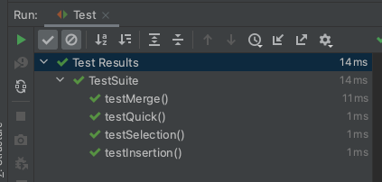

# Dependency Management and Unit testing

## Table of Contents

## Metaprogramming

This Lab is a continuation of the metaprogramming topics from last week.

This week we will be covering dependency management and unit testing, two 
extremely useful topics for all Computer scientists. See the introduction to 
metaprogramming [here](build_systems_and_cont_int#metaprogramming).

## Dependency management

Hopefully you've seen last weeks section on build automation systems, and so 
you've got the idea of dependencies. It's likely a project will have 
dependencies that are themselves projects. Maybe relying on installed programs 
(like `python` or `pdflatex`), system packages (like `opelssl`), or libraries 
within a programming language or technology (like `matplotlib` or `graphicx`). 

The majority of these types of dependencies will be available through 
repositories which hosts a large number of the dependencies you would want. For 
example there is the "Ubuntu package repository: for Ubuntu packages, or "PyPi" 
for Python Libraries. 

### Programming language library dependencies 

In any project you are likely to want to use project and libraries made by other 
people. This is and has always been one of the best things about computer 
science. Most all projects would be nigh on impossible if you and/ or your team 
had to make it all. Instead collectively computer scientists all around the 
world both indies and from different companies contribute together to every 
project you could make.

However, as beautiful and inspiring this can be, it does present a difficult 
problem, how can you get these libraries and modules into your projects.
Sounds easy enough, but turns out to become one of the biggest headaches 
Computer Scientists deal with.

In a theoretical ideal world where each library was feature complete and bug 
free when it was released this would be easy. Copy the code into your project 
and use it. Simple. However, the world has an irritating resistance to being 
simple and perfect. 

All modules should be updated often, fixing bugs and adding features. This may 
lead you to think you could just use one version, live with the bugs and feature 
set of that version, and certainly this strategy is sometimes used. But in a lot 
of projects, there will be security considerations. In these projects it is 
essential that you keep up to date with the latest releases in order to not have 
known vulnerabilities in your project. 

Additionally, you may need new features, or new features may become demanded by 
your users, or your platform may deprecate versions of libraries you're using. 

I'm going to stop listing considerations because I could go one for a while, 
what should become clear is that the complexity of the world causes spiralling 
complexity that would very quickly make any manual solution to this problem 
untenable. 

Thus we have dependency managers, most languages and technologies have one, if 
not many, and how they work is varies. However, they can save you a lot of time 
and headaches. 

Most dependency managers allow you to have a list of dependencies your project 
needs, then will download them on command. This is useful for version control as
the version control system doesn't have to deal with the library files, just the 
file listing the dependencies. 

Additionally, it is common that libraries will in turn require other libraries, 
most dependency managers have systems for dependencies defining their own 
dependencies and fetching them. Additionally it will avoid duplicates if 
multiple dependencies require the same libraries.

### Example

We're going to do a very brief example with the Node.js npm tool.

Ive made an extremely simple node application that uses another npm module. To 
use npm to manage the dependencies first I have to make a `package.jsom` file:

```json
{
  "name": "TechnicalLabsExample",
  "version": "1.0.0",
  "description": "Example app",
  "author": "Alfie Richards",
  "dependencies": {
    "mathjs": "8.0.1"
  }
}
```

**Note:** As always the files we use in these examples are available in the 
[technical Labs repository](https://github.com/bath-bcss/Technical-Labs).

In the dependencies you can see I require a module called "mathsjs" and I
require a specific version. I can then get node to install the modules and any 
of its dependencies with the command `npm install`, then npm will fetch the 
module, and I can use it in the node program. It stores them in the 
`node_modules/` directory.

```node 
mathjs = require("mathjs")

console.log(mathjs.round(mathjs.e, 3))
```

Then running `node main.js` returns `2.718` using the module. `npm` has a lot 
more features also, but we won't cover them in these labs.

## Unit testing

It would be great if everything always worked as intended, but it rarely does. 
To ensure that your software does what its supposed to we test it. I'm sure 
everyone has done manual testing, I spent a  long time copying and pasting into 
my SRPN coursework to check it worked. But this testing can very quickly become 
very tiresome, so we can automate it!

Unit testing is a type of testing that focusses on testing the smallest 
components. For each component of your software solution you make a collection 
of tests to make sure that functionality works. A great unit testing suite can 
build confidence when working as you can always run the unit tests to make sure 
you haven't broken any functionality.

Additionally, when using a continuous integration setup with unit tests you will 
be able to see exactly with what commits functionality was added or bugs 
introduced.

Often, as manual testing can be slow and time consuming, making a suite of unit 
tests can often save a lot of time compared to the time it would take to test 
everything manually.

There are a lot of frameworks and libraries to make unit testing easier. A lot 
of platforms have their own unit tests also. Additionally for GUI projects you 
can make automated tests to test graphical components for many platforms. For 
example [Androids UI 
Automator](https://developer.android.com/training/testing/ui-automator).

### Example

In this example I'm going to make some unit tests for my Data structures and 
algorithms coursework. I'm going to use the popular JUnit test suite which is 
for Java.

The coursework involves implementing 4 different sorting algorithms. My unit 
test is going to shuffle two sorted arrays and then check the output of my 
functions is the same as the original arrays.

```java
import org.junit.jupiter.api.Test;
import static org.junit.jupiter.api.Assertions.assertTrue;

import java.util.Arrays;
import java.util.Collections;
import java.util.List;

public class TestSuite {

  Contact[] test1 = new Contact[] {
    new Contact("C", "C"),
    new Contact("A", "B"),
    new Contact("B", "A"),
    new Contact("B", "B"),
    new Contact("A", "A")
  };

  Contact[] test2 = new Contact[] {
    new Contact("", "9"),
    new Contact("", "8"),
    new Contact("", "7"),
    new Contact("", "6"),
    new Contact("", "5"),
    new Contact("", "4"),
    new Contact("", "3"),
    new Contact("", "2"),
    new Contact("", "1"),
    new Contact("", "0")
  };

  public TestSuite() {
    Arrays.sort(test1);
    Arrays.sort(test2);
  }
 
  @Test
  void testSelection() {
    Contact[] testArray1 = Arrays.copyOf(test1, test1.length);
    List<Contact> testList1 = Arrays.asList(testArray1);
    Collections.shuffle(testList1);
    testList1.toArray(testArray1);

    Contact[] testArray2 = Arrays.copyOf(test2, test2.length);
    List<Contact> testList2 = Arrays.asList(testArray2);
    Collections.shuffle(testList2);
    testList2.toArray(testArray2);

    Sorter.selectionSort(testArray1);
    assertTrue(Arrays.equals(testArray1, test1));

    Sorter.selectionSort(testArray2);
    assertTrue(Arrays.equals(testArray2, test2));
  }

  // ... Repeat for 3 other sorting algorithms

}
``` 

Note I annotate the funtione with `@Test` to let JUnit know to run these 
funciton when I run the tests. I then call the `assertTrue()` function. If the 
value I pass in is false then the test will fail.

Now as I change or implement algorithms I can always very quickly and reliably 
make sure the algorithms work. 

Here you can see in IntelliJ that all tests passed, and that the tests only took 
14ms, so I could run them as often as I wanted.



## Credit

Inspired by [Missing semester series](https://missing.csail.mit.edu). Research 
from [JUnit documentation](https://junit.org/junit5/), [npm 
documentation](https://docs.npmjs.com/about-npm), and [node.js 
documentation](https://nodejs.org/en/docs/).

Written by [Alfie Richards](https://www.alfierichards.com)

Editing by [Joseph Cryer](mailto:jjc82@bath.ac.uk).

Thanks to:


For additional help

Please send any corrections [here](mailto:alfierchrds@gmail.com).
