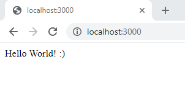

# A web stack in an hour

## Table of Contents

1. [Introduction](#introduction)
2. [The Theory](#the-theory)
    1. [What is the Web](#what-is-the-web)
        1. [History of the web](#history-of-the-web)
    2. [What is a Web Page and a website](#what-is-a-web-page-and-a-website)
        1. [HTML](#html)
        2. [CSS](#css)
        3. [JavaScript](#javascript)
        4. [Summary](#summary)
    3. [What is a server?](#what-is-a-server)
        1. [Server side vs Client side](#server-side-vs-client-side)
    4. [What is a browser](#what-is-a-browser)
    5. [APIs](#apis)
    6. [HTTP](#http)
    7. [Security](#security)
    8. [URLs](#urls)
3. [Getting Started](#getting-started)
    1. [Dependencies](#dependencies)
        1. [Node.js](#nodejs)
        2. [npm](#npm)
        3. [Code editor](#code-editor)
    2. [Initial Node.js Project](#initial-nodejs-project)

## Introduction

Welcome to "A web stack in an hour", where we are going to attempt to tech the 
basics of a web stack in an hour. 

First things first, we'd like to start by saying this is a bad idea, the web as 
a whole and a web stack are very complicated and you could devote your life to 
learning about the web and not know half of what there is to know. 

In order to fit such a wide topic matter into one hour we're going to move very 
fast and miss a lot of important details that you will need to learn in order to 
release a full project. We are going to teach the bare minimum for getting a web 
app up and going.

We've split this into two sections. In the first we'll go through the theory of 
the web and give valuable context for working with the web. After that we'll 
make a basic web app together as an example project and use this to explore some 
of the ideas we've covered.

## The Theory

 The way the web and the internet are presented in the world are unhelpful for 
 developing so first we're going to re-introduce the web and some history, which 
 is useful context for understanding why the web is the way it is.

### What is the Web

Ofter the "Web" and the "internet" are conflated but they are different things.

The "Internet" is the global system of networks that connects together computers 
around the world using the internet protocol suite.

The "Web" refers to the World Wide Web, which is an information system that 
works on top of the internet to share documents and other web resources.

The internet is used for a vast array of purposes, of which the World Wide Web 
is one. 

A "web stack" is a collection of technologies used to make a web app for the 
World Wide Web.

#### History of the web

The world wide web was started in 1989 by Sir Timothy Berners-Lee at CERN. Over 
the 1980's the internet had spread across academic institutions in Europe and a 
connection to America had been established. Burners-Lee started discussing a 
system to share and ofganise documents and information. The first website was 
published on 20th December 1990 as well as the first web server. Burners-Lee and 
his team also made a language for describing the documents, **H**yper**T**ext 
**M**arkup **L**anguage, (HTML) and a protocol for requesting the documents over 
the internet, the **H**yper**T**ext **T**ransfer **P**rotocol (HTTP).

This isn't just history trivia, it's important for understanding the modern web. 
The web started as a system to retrieve simple text documents and data with a 
way to link them together, everything else that makes up the modern web is a 
combination of hacks and additions to this initial simple system.

### What is a web page and a website

A webpage is simply an address which returns a HTML file when requested by a 
browser. A website is simply a collection of these webpages that link to each 
other, normally hosted on a single server under a single domain. Each HTML file 
can also request other files it requires, such as images or other data. 

While technically all you need for a webpage is HTML, modern web pages need 
additional styling with CSS and dynamic functionality from JavaScript files. 

#### HTML

HTML files are the basis of any webpage. HTML contains the content and the 
structure of the webpage along with any other files that need to be fetched. 
While it can contain style information and JavaScript blocks this is cumbersome 
and rarely done.

Here is the HTML for the file for the website we'll be building later:

```html
<!DOCTYPE html> <!--1-->
<html> <!--2-->
    <head>
        <script src="https://ajax.googleapis.com/ajax/libs/jquery/3.5.1/jquery.min.js"></script> <!--3-->
        <link href='https://fonts.googleapis.com/css?family=Exo 2' rel='stylesheet'>

        <script src="js/main.js"></script> <!--4-->
        <link rel="stylesheet" href="css/main.css">
    </head>
    <body>
        <div id="mainBlock">
            <h1 class="title">Click the button!</h1> <!--5-->
            <p class="subtitle">A very small amount of CSS goes a long way :)</p>
            <button class="btn draw-border" id="button1">Count: 0</button><!--6-->
        </div>
    </body>
</html>

```

Let's run through what this does, every section like `<!--Text-->` is a comment 
and only serves to annotate the file.

1. This line simply describes what the document is to the browser, it can be ignored
2. This is a "tag" which starts the web page
3. This is request to import another file, in this case from a completely 
   different website. This imports a section of code for a library called JQuery 
   and a CSS file for fonts
4. Here we import our JavaScript file and the CSS file we also need for this 
   webpage.
5. This line defines a title for the page.
6. This line defines a button on our page.

#### CSS

CSS (Cascading Style Sheets) is used to style our webpage, it can act on types 
of element (like `h1` or `button`), classes of elements (like `"title"`) or 
specific element id's (like `"button1"`)

Heres the CSS for our website

```css
body { /* 1 */
    font-family: 'Exo 2';
    background-color: #F3F5F6;
}
  
.title { /* 2 */
    font-weight: bold;
    font-size: 50px;
    color: #2C3E50;
    text-transform: uppercase;
    text-align: center;
    margin-top: 1%;
}
  
.subtitle {
    font-weight: 400;
    font-size: 30px;
    color: #2C3E50;
    text-transform: uppercase;
    text-align: center;
    margin: 10px;
}

#mainBlock { /* 3 */
    text-align: center;
    width: 60%;
    border: black 1px;
    margin: auto;
}

.btn {
    cursor: pointer;
    line-height: 1.5;
    font: 700 1.2rem "Exo 2";
    text-transform: uppercase;
    padding: 1em 2em;
    letter-spacing: 0.05rem;
    width: 20%;
    margin: 10px;
}

```

Here `/* Comment */` is purely to annotate the code.

1. This block applies to every element within the body tags, which is the entire 
page, it sets the font and background of the page.
2. This block applies to all elements with the `title` class. It changes the 
font size, colour and alignment.
3. This block applies to the element with the `mainBlock` id, it centers all the 
child elements, sets a default width (60% of the parent element), and sets a 
border.

#### JavaScript

Lastly heres the JavaScript for the website, JavaScript is the code that runs on 
the website, often called the "client side" code, because it runs on the client 
machine with in the web browser.

```javascript
$(document).ready(function(){ // 1
    var count = 0;

    $('#button1').click(function() { // 2
        count++;
        $('#button1').html("Count: " + count); // 3
    });
});
```
Any code like `// comment` is purely annotation.

Here we are using a JavaScript library called JQuery to make lots of this 
simpler, we will go more into this later.

1. This line indicates we would like this code to be run as soon as the webpage 
   loads.
2. This line indicateas we'd like this code to be run the button `button1` is 
   clicked.
3. This line updates the text of the button.

#### Summary

These 3 file types define and make up every webpage (with a few exceptions). So 
clearly a lot can be achieved with only these elements! To learn more we 
strongly recommend [W3 Schools](https://www.w3schools.com).

Heres the website these files make: 


### What is a server

There is another, very important part of this story. The part that serves up the 
web pages, and keeps track of any other data you need for your website. The 
_server_ sometimes also called the backend. 

Unfortunately "server" is an overloaded term, server can mean the system itself, 
or the software running on the system. In this lab we will use "server" to mean 
the software.

One of the jobs a server does is simply serving the website files required. 
Sometimes that is all the server does, for instance this website is a static 
site, where the content doesn't change. However for most websites of interest 
the site will change and show different content at different times and for 
different users. Additionally some websites want to store data between visits to 
a site. All of this is the role of the server.

In this lab we will write a server program to serve our website, as you will see 
later. We will use a technology platform called node.

#### Server side vs Client side

The client server distinction is often confusing at first. You can execute code 
on both and often certain tasks can be done on either side. So we wanted to 
explain in some more depth.

Server side code runs on the server, this will be where you store user data and 
any data relevant to the entire website. Often data is stored in databases that 
run along side the server on the same machine, but we wont cover databases here.
This means there is very little delay between the data and the server software 
so any large data crunching should be done here.

The client side code runs on the users machine, within the browser. Often code 
will run quite slowly in the browser, and any data will have to be retrieved 
from the server over the internet, so there may be a delay or the request might 
fail.

We will cover this more in the example.

### What is a browser?

Another point of confusion is what a browser is and what a browser does. To use 
the web you must use a browser, like Google Chrome, Firefox, or Safari. The 
metaphor for a browser is a your porthole into the web, to enable you to explore 
the web, hence names like Safari and Internet Explorer. 

The basics of a browser are that a user inputs a URL into a browser and the 
browser will establish a connection to the server at that address, it will make 
a request for the file at the address and display the result to the user. 
Normally that file is HTML, which will be displayed as a web page. Though you 
can view other files.

This is an oversimplification, browsers are incredibly complex pieces of 
software, and have a full engine for running JavaScript, complex systems and 
standards for displaying web pages correctly, and entire subsystems for 
streaming video and audio, but, thankfully, the majority of this complexity is 
abstracted away from a web developer.

While browsers do differ in how they work and in functionality most modern 
browsers are interoperable. This was a large issue not too long ago, before 
internet Explorer lost the vast majority of its market share but is less of an 
issue now, but still valuable to be aware of. You should check your website with 
most popular browsers.

### APIs

Another important part of the story we're missing is APIs, or **A**pplication 
**P**rogramming **I**nterface, API is a very broad term, it simply means the 
interface which defines interactions between different pieces of software. In 
this case we mean a **web API**.

Essentially an API is very similar to a traditional webserver, and is often part 
of a web server, except instead of serving HTML webpages and other website 
relevant files upon HTTP/HTTPS requests it returns or receives other data. For 
instance, Wikipedia has a webserver where they serve up HTML pages for their 
articles, however, if you wanted to make a mobile app to display wikipedia 
articles you would rathed just the text then the HTML for the web page. For this 
reason wikipedia has a [web API](https://commons.wikimedia.org/w/api.php) to 
where you can retrieve jsut the content of the article, or submit a request to 
change and article.

We will be making an extremely simple API in the example.

### HTTP

We should very quickly discuss HTTP here, it is the language used to communicate 
between the server and the client. Its a complicated topic, but all we need to 
know for this tutorial is there are 9 types of HTTP request, of which we are 
only concerned with 2 in this lab. A "GET" request simply requests the specified 
resource. A "POST" sends a resource and requests it is updated or inserted. 

Another important note is that all requests are initiated by the client. A 
server cannot notify the client of an update. For cases where you wish to do 
this you need to use a "websocket" which aren't covered in this lab. Websockets 
do not use HTTP, and instead work across another connection and are therefore 
more complicated.

### Security

A massive consideration when talking about web development is security and, for 
that purpose, encryption. The web started out very insecure with almost all 
messages across the internet unencrypted. That has had to change, and nearly 
all of the modern web uses more secure standards and technologies now. 

Most notibly is HTTPS, the encrypted and certificate based replacement for HTTP. 
HTTPS is extremely important, however HTTPS is time consuming to setup and 
presents much more complexity to the developer, so normally is done without, 
especially when connecting to your server over a local network or over 
localhost. 

### URLs 

We also wanted to very quickly touch on URLs (**U**niform **R**esource 
**L**ocators) which are in themselves a subset of URIs (**U**niform **R**esource 
**I**dentifiers). URLs are used to reference a web resource and specify its 
location within a computer network. 

A URL is made up of 7 parts, most of which are irrelevant for this lab. We are 
mostly concerned with the scheme, host, port and path. These can be combined in 
the following way:

```
scheme://host:port/path
```

Or

```
scheme://host/path
```
If no port is required. For our cases the scheme should be http (or https). 

The host would normally be a "domain name", which is a complicated way of using 
a string like "www.google.com" to point to an IP address your browser can 
actually connect to to request the files. We will not cover domain names and DNS 
here. However, what we do need to know, is that we can use an IP address, and if 
we are running the server we want to connect to on the machine we want to access 
it from, as you would when developing, you can use "127.0.0.1" or "localhost" to 
specify the local machine. We will see this in the example.

The path section communicates to the server what resource you want, how this is 
communicated varies server to server.

## Getting Started

### Dependencies

#### **Node.js**
**Node.js** is a JavaScript runtime environment. We'll be using it as the 'server' for our web app. Head [here](https://nodejs.org/en/download) to download the installer (unless on Linux, then you're on your own). Follow the installer instructions and you should be good!

To check that it is installed, run this command in your terminal:
```
node -v
```

#### **npm**
**npm** (or '**N**ode **P**ackage **M**anager') is the package manager for JavaScript. It is distributed with **Node.js**, meaning that when you download **Node.js**, **npm** is automatically installed. 

To check that it is installed, run this command in your terminal:
```
npm -v
```

#### Code Editor
A good code editor is incredibly important, and helps you massively in the long run.
Having said that, we don't have time to cover this. [Visual Studio Code](https://code.visualstudio.com/download), [Jetbrains WebStorm](https://www.jetbrains.com/webstorm/download/#section=windows) (you get this for free with a student license) or [Atom](https://atom.io/) are all good choices for web development. We will be using VS Code. 

### Initial Node.js Project

In this project, Node.js will run on a 'server' computer and will host a webserver. Anybody that goes to the correct web address will be accessing the webserver and interacting with whatever we write. 

Let's start by making an **app.js** file. 

```js
const express = require('express');
const app = express();

const port = 3000;

app.listen(port, () => {
  console.log(`Example app listening at http://localhost:${port}`)
});
```

This is a bare-bones initial Node.js server. However, if we try to run this with the command `node app.js`, it will immediately fail, as we are using the **express** library. To install this, run the command `npm install express` in the folder. Once this has installed, we should be able to run the server with `node app.js`! 


If we go to the web address [localhost:3000](localhost:3000), we see an error message: **Cannot GET /**. This is fine, as we aren't yet providing any content, but still shows that the server is functioning.


**Postman** is an application that allows you to inspect HTTP web requests in detail. Let's see what the Node server is sending to the client when we go to [localhost:3000](localhost:3000).

 

The top section defines the request being made, while the bottom section shows the data that has been returned from the server.

This is a default HTML page being created by Node for endpoints that haven't been specified. This is the same as the content being displayed in the browser.

Now, let's provide some content to display! We're going to add a **GET** endpoint for **/**, which is the 'root' page - [localhost:3000](localhost:3000). To do this, we want to add a new code block in **app.js**: 

```js
app.get('/', (req, res) => {
    res.send("Hello World! :)");
});
```

Now, whenever we navigate to [localhost:3000](localhost:3000), we should be served the content "Hello World! :)". 

 

All that is being sent by the server is the plain text. We can see this when checking the endpoint in Postman:

 

Now, let's start serving a HTML page. Below is a simple HTML example - the one that we went through earlier. I'm going to create a folder called **public** and save this inside as **test.html**. 

```html
<!DOCTYPE html>
<html>
    <head>
        <script src="https://ajax.googleapis.com/ajax/libs/jquery/3.5.1/jquery.min.js"></script>
        <link href='https://fonts.googleapis.com/css?family=Exo 2' rel='stylesheet'>

        <script src="js/main.js"></script>
        <link rel="stylesheet" href="css/main.css">
    </head>
    <body>
        <div id="mainBlock">
            <h1 class="title">Click the button!</h1>
            <p class="subtitle">A very small amount of CSS goes a long way :)</p>
            <button class="btn draw-border" id="button1">Count: 0</button>
        </div>
    </body>
</html>
```

I've also defined **main.js** and **main.css** files within this file. Let's create those too, inside subfolders **js** and **css** respectively.

**main.js:**

```js
$(document).ready(function(){
    var count = 0;

    $('#button1').click(function() {
        count++;
        $('#button1').html("Count: " + count);
    });
});
```

**main.css:**

```css
body {
    font-family: 'Exo 2';
    background-color: #F3F5F6;
}
  
.title {
    font-weight: bold;
    font-size: 50px;
    color: #2C3E50;
    text-transform: uppercase;
    text-align: center;
    margin-top: 1%;
}
  
.subtitle {
    font-weight: 400;
    font-size: 30px;
    color: #2C3E50;
    text-transform: uppercase;
    text-align: center;
    margin: 10px;
}

#mainBlock {
    text-align: center;
    width: 60%;
    border: black 1px;
    margin: auto;
}
  .btn {
    cursor: pointer;
    line-height: 1.5;
    font: 700 1.2rem "Exo 2";
    text-transform: uppercase;
    padding: 1em 2em;
    letter-spacing: 0.05rem;
    width: 50%;
    margin: 10px;
  }
  .btn:focus {
    outline: none;
  }
```

Our file structure should now look something like this:

 

Now that we've created some content to serve, let's serve it! We need to use the built-in **Path** library, so we need to import it at the top of **app.js**.

```js
const path = require('path');
```

When someone goes to the **/test** endpoint, we want to show them **test.html**. To do this, we need to create a new endpoint, like we did before, but instead of serving plain text we need to serve the file itself.

```js
app.get('/test', (req, res) => {
  res.sendFile(path.join(__dirname + '/public/test.html'));
});
```

If we go to the [http://localhost:3000/test](http://localhost:3000/test) endpoint, we can see the page we created! However, upon a closer inspection, there is no CSS styling and the JavaScript isn't functioning properly. Here, I opened up the Chrome Developer Tools (by clicking F12) and went to the Console tab, to see the errors in the page. 

 

We can see that **main.js** and **main.css** aren't accessible by the page. That is because the **public** folder isn't actually public yet - Node is protecting it! Let's change that. Add this line to **app.js**:

```js
app.use(express.static('public'));
```

This line tells Node to allow direct access to any files within the **public** directory. 

Now that we've done that, we can see that the page has no more errors, and is correctly styled!


Now that the **public** directory is directly available, we can access any of the files within it through the web browser, using relative URLs. For example, we can look at **main.css** with the URL [http://localhost:3000/css/main.css](http://localhost:3000/css/main.css) and **main.js** with the URL [http://localhost:3000/js/main.js](http://localhost:3000/js/main.js).


#### State
The system we've created so far is a counter. Whenever we click on the button on the webpage, the number increases by 1. However, this is entirely implemented within the clientside JavaScript. Within the browser, it is difficult to retain **state**. By this, I mean that if we were to refresh the page, the current count value would be reset to 0, as the count value is lost and recreated on reload of the page. 

There are ways to retain state entirely within a browser (see [cookies](https://www.w3schools.com/js/js_cookies.asp)), however we will not cover this. Instead, we will show you how to communicate between the client and the server to store and load data. 

Let's first create a few new API endpoints on the server. 

In **app.js**, add the following code towards the top of the file (after `const app = express();`):

```js
app.use(express.json());

var counter = 0;
```

This code defines a new variable called **counter**, which is an int set to 0. It also pulls in the **Express JSON** functions, allowing us to parse and understand the JSON objects being sent back and forth between the client and server as messages. 

Next, we will create a new GET endpoint: **/api/getVal**

```js
app.get('/api/getVal', (req, res) => {
    let retVal = {count: counter};
    res.send(JSON.stringify(retVal));
});
```

Whenever we visit [http://localhost:3000/api/getVal](http://localhost:3000/api/getVal), this code will create a JSON object containing the current value of the **counter** variable we just defined.

 

Next, let's create a simple POST endpoint: **/api/increment**

```js
app.post('/api/increment', (req, res) => {
    counter += parseInt(req.body.count);
    res.send(JSON.stringify({count: counter}));
});
```

As this endpoint is a POST and not a GET, it requires that we send it data of some sort. Whenever a POST request is sent to it with a **count** value in its body, the **counter** value on the server is increased by that **count** amount and the server replies with the new value of **counter**. 

Here, I will simulate a POST request to the endpoint using Postman:

 

Here, I run the POST request and the **count** value is incremented from 3 to 4. If I run the call again, it will be incremented to 5: 

 

With these two calls, we can now implement some sort of state for this variable that survives the refreshing of a web page. Let's modify our JavaScript code in **main.js** to use these API calls.

```js
$(document).ready(function(){
    $.get('api/countVal', function(data) {
        let count = JSON.parse(data).count;

        $('#button1').html("Count: " + count);
    });

    $('#button1').click(function() {
        $.post('api/increment', {'count': 1}, function(data) {
            let count = JSON.parse(data).count;
            $('#button1').html("Count: " + count);
        });
    });
});
```

When the page loads, the code now makes a GET request to the API to get the **count** value from the server. When it gets this, it updates the HTML to display this value. 

Whenever the button is clicked, a POST request is made to the API, passing in a **count** value of 1 - the value on the server will be incremented by 1, the server will return the new value, and the client will update the HTML to display this value. 

