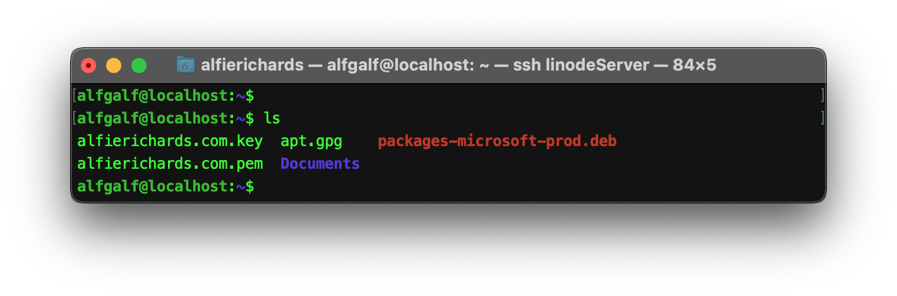
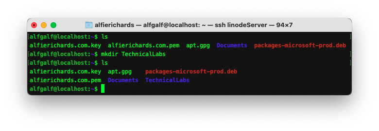
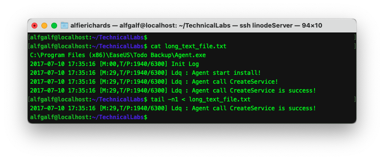

# Unix Shell

## What is Unix

When people say Unix they normally mean the family of Unix-like operating systems that derive from
the original AT&T Unix operating system. The original Unix was written (along with the C
programming language) in the 1970s by Ken Thompson, Dennis Ritchie and others. There are many
Unix-like operating systems - macOS and Linux being the two most popular for desktop, with iOS and
Android dominating the mobile market.

Unix-like systems are characterised by a modular design where functionality is made up of simple
tools. Each tool performs a well defined function, and can be combined with other tools to together
become more complex. Unix-like operating systems consist of many libraries and utilities along with
a master control program - the kernel. The kernel handles starting and stopping programs, the file
system, and other low level tasks that programs share.

Unix was instrumental in the development of the internet and still comprises the vast majority of
the machines that make up the internet.

## What is the shell?

The shell is the command line interpreter for Unix-like operating systems, used to control the
computer. The name "shell" refers both to the language you use to input commands and write scripts,
and the program that runs those commands or scripts.

Users tend to interact with the shell through a terminal emulator. As the name suggests, this
emulates old style computer terminals. This is normally the "Terminal" app on your computer. When
you enter commands into a terminal emulator, it passes those commands to the shell to run. Those
commands might be requests to run built-in functionality of the shell, shell scripts, or installed
programs. The output of the command is then sent back to the terminal emulator and displayed.

The most common shell is the **B**ourne **A**gain **Sh**ell, or bash for short, but shells like the
**Z Sh**ell (zsh) and the **F**riendly **I**nteractive **Sh**ell (fish) are gaining popularity.
We'll be using bash.

## How to install a Unix-like command line on your computer

For Mac and Linux users this answer is very simple. You are already running a Unix-like operating
system! Install the terminal emulator of your choice (or use the pre-installed options) and you're
ready.

For Windows the answer is more complicated. As Windows is not a Unix-like operating system it
doesn't use a Unix shell. Instead, it uses PowerShell, which isn't very widely used and is
incompatible with most Unix tools.

However, all is not lost! With Windows 10, Microsoft added a feature called Windows Subsystem for
Linux (WSL), which allows Windows users to use a Unix shell (like bash) and almost all of the GNU
utilities that make up Linux, just without the Linux kernel (or, since WSL 2, through a Linux kernel 
running in a virtual machine).

To install go to [this
page](https://www.howtogeek.com/249966/how-to-install-and-use-the-linux-bash-shell-on-windows-10/),
which gives instructions on installing a bash shell, then almost everything should be the same from
there on out.

## How to use the Unix shell

When you open the terminal you will be presented with a **prompt**, which will look something like:

```
user:~$
```

This will be where you write commands. The dollar symbol tells you that you are not the root user,
but we'll get to that later.

There are a few things to be aware of when using a Unix shell: where you are and who you are.

### Where

The **where** is what directory you are in. In a Unix shell you always have a working directory. To
find your current working directory use the command `pwd` (short for "print working directory").


You can see the shell prints out the current directory. If you've just started the shell you'll be
in your user's **home directory**. In Unix you can always find the home directory, as `~` represents
the current user's home directory - that's why it's in the prompt (`user:~$`).

To change the working directory use the `cd` ("change directory") command followed by where you want
to go.


You can give `cd` either a relative or an absolute path. The difference is that absolute paths start
with a leading `/`, pronounced "root", which represents the absolute top-level folder on your hard
drive. Any path that doesn't start with `/` is a relative path, so instead of starting from `/` it
starts from your current folder.


To list all the directories and files in the working directory use the `ls` command, short for
"list".



In Unix any directories starting with a `.` are hidden by default. To show these hidden files add
the `-a` flag to the `ls` command.


There you can see some unexpected entries. What are `.` and `..`? In every directory in Unix there
is `.` to represent the current directory, and `..` to represent the parent directory.

Combining this with `cd` and relative paths we can use `cd ..` to navigate to the parent directory.


### Who

All Unix-like systems have a user system, and different users can access different files and
different commands.

You can check what user you are with the `whoami` command.


You can then change users by using the `su` command followed by the user you want to switch to.
"root" is the super user in Unix and so has all privileges. You shouldn't work as "root", because
you might do something destructive by accident. The shell makes it clear you're root as the `$` is
replaced by a `#`, and the prompt may change also.


If you want to run just one command as the `root` user (a very common occurence), you can use the
`sudo` command (short for "super user do") followed by the command you want to run. This will
normally prompt you for an administrator's password or the root user password.

## Basics of Unix

Now you know the basics of getting around and how to change user, let's start using some commands!

In the Unix shell, a command is structured with the name of the command followed by some arguments.


Here in red you can see the **Command**, in this case `git` (the subject of a future lab), followed
by a list of arguments in blue.

The command can fall into a few categories:

1. **Internal commands** - Certain commands are build into the shell. The shell directly interacts 
   with the OS and no other executables are required.
2. **Included commands** - Some executables come included with and are considered part of the
   operating system.
3. **External commands** - Executables the user has installed.

If the command comes in the first category then the shell hands the job straight off to the kernel
to handle. Otherwise, the shell has to find the command you want to run. To do this, it goes and
looks for executables with the name you specified in special directories. These directories are
specified by the PATH variables, which will be covered later.

You can find if any command is in the first category with the command `type <command name>`.

Parameters are separated by spaces, unless multiple are surrounded in speech marks. In this case,
they are treated as one parameter. One common style of parameter is a "flag". Flags look like the
`-a` and `-m` above and generally alter the command's behaviour in some way.

Different commands take different parameters in different orders. How are you meant to know these
parameters? You can look at the `man` pages.

## Man Pages

Man is short for manual, as the man pages are the manual for each command. Man pages contain
information like how to use a command, what it does, what parameters it requires, along with the
command's optional parameters and flags.

To look up the man page for a command use:

```bash
man <command>
```

Scroll through the manual with the arrow keys (or `d` and `u` for down and up), and press the `q`
key to exit the man page.

Man pages are an essential resource for learning Unix, and a great quick reference if you forget
parameters or flags for a command.

You can also use man pages to find commands, by using:

```bash
man -k <keyword>
```

You will be presented with a list of commands that use that keyword in their description.

Additionally, bash has `help` pages for built-in commands, for example `help pwd` gives you help on
the `pwd` comamnd.

## File management in Unix

One of the first things you may want to do is manage files and directories. This can be done with
the Unix shell.

### Making directories

Making a directory is as simple as `mkdir <directory name>`



### Moving and renaming files and directories

The `mv` command has multiple uses. It allows you to move a file or directory from one file path to
another.

You can change the directory a file is in:

```bash
mv <current directory path>/<file name> <new directory path>
```

You can also move a directory to another directory:

```bash
mv <current directory path> <path of directory to move it to>
```

You can also use it to rename a file or directory:

```bash
mv <file name> <new file name>
```


### Deleting files and directories

To delete a file use the `rm <file path>` command.

To delete a directory use the `rmdir <file path>` command. This can only be done on empty
directories.

To delete a directory and its contents use the `rm` command with the `-r` flag to delete
recursively.

***Warning:*** In Unix there is no "trash" directory where deleted files go. When you delete a file
it is gone.


### Copying files and directories

Copying is handled by the `cp` command, which is the same as the `mv` command but moves a copy of
the file or directory to the new file path.

## Environment Variables

Earlier we said the shell was a scripting language, and like any other programming language it can
make use of variables. The command `export <variable name>="<data>"` defines a variable.

Then by writing `$<variable name>`, bash unpacks the variable to its string.


The `echo <argument>` command simply prints the parameter given to `stdout`, with variables expanded.

All the variables together make up the "environment". Programs can read the environment variables
as well as any values passed into them. So, changing these environment variables can change the
behaviour of programs.

### Path Variables

The "PATH variable" is a special variable in the environment. We can get the value with `echo
$PATH`.


Here you can see a big list of file directories. This is where the shell goes looking for the
executables you want to run. You can look in the directories themselves to find a path, but if you
need to find one particular executable you can use the `which <command>` command.


You can also run executables directly with their absolute path or local path - this is how you could
run executables you make yourself without putting them in the path directories!


## Connecting programs together

Unix programs can take input and return output through two primary streams: the input stream
(standard input, normally "stdin") and the output stream ("stdout"). By default, stdin is what you
type into the terminal emulator and stdout is printed to the terminal emulator.

If you've ever written a Python program the `input()` statement reads from stdin and the `print()`
statement writes to stdout.

Stdout doesn't have to simply be printed out, though, and stdin doesn't always have to come from
keyboard input. You can use the `>` operator after a command to redirect stdout from that command
somewhere else, like to a file.


The `cat <file path>` command reads a file and outputs it to stdout.

Likewise, you can use the `<` operator to read a file into stdin for a command.



The `tail -n1` command returns the last line of the stdout.

Lastly, you can connect one program to another with a pipe: `|`. With a pipe you can take the
output of one program and feed it into another.


Here the `ip a` command lists lots of networking information, but I only want the line about the IP
address starting "127.". So, I can use the `grep <string>` command that lets you search the standard
stdin for strings and outputs the lines containing the strings to stdout.

## Going forwards

Hopefully you now know how to move around the shell, change users, manage files, and accomplish
basic tasks with the Unix shell. Hopefully this introduction allows you to learn more from other
online resources, as you'll understand what's going on.

There's a lot more you can do with the shell - if we covered it all it would take the whole year!
Some more will be covered in future Technical Labs but this should give you a good base to work
from. Man pages are your friend - if you don't understand a command never be afraid to use them.

Exercises
---------

If you want to work on your Unix skills here are some good practise exercises:

1. Install and open a Unix shell!
2. Navigate to your home folder and then explore the file system. Use `cd`, `ls`, and `pwd` to get
   around.
3. Create a new directory.
4. Rename a directory.
5. Look up the `touch` command.
6. Make some files!
7. Look into Unix permission system and change some permissions!
8. Try playing around with `<`, `>`, and `|`.
9. Look at your PATH variables and try to find the executable of a command you know.

# Credit

Written by [Alfie Richards](mailto:alfierchrds@gmail.com).

Editing by Joseph Cryer(mailto:jcryer1234@gmail.com).

Thanks to:

- Dr Russell Bradford
- Bence Babrián
- [Søren Mortensen](https://neros.dev)

For additional help

Please sent any corrections [here](mailto:alfierchrds@gmail.com).
