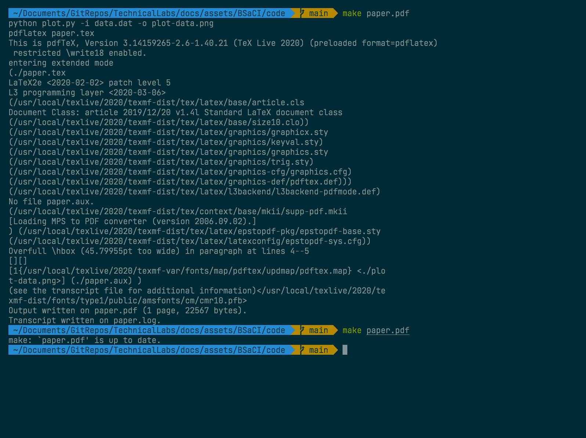
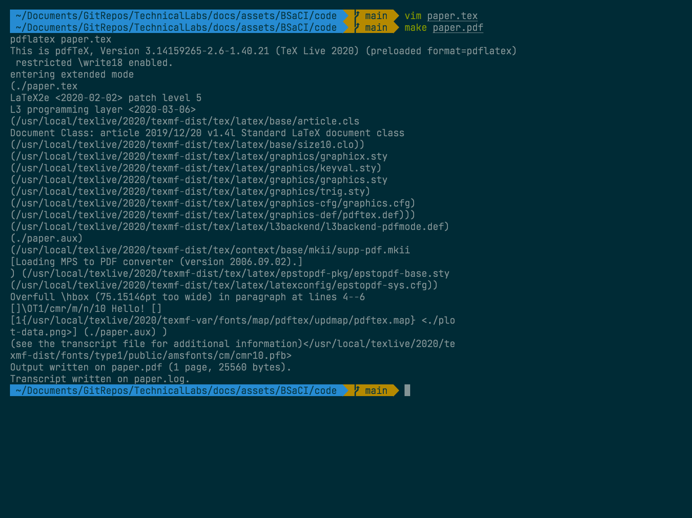

# Build Systems and Continuous Integration

## Table of Contents

1. [Metaprogramming](#metaprogramming)
2. [Build automation systems](#build-automation-systems)
    1. [Example](#example)
3. [Continuous integration systems](#continuous-integration-and-deployment)
    1. [Example](#example-1)
4. [Credit](#credit)

## Metaprogramming

As a computer scientist you will be aware of the amazing power of computers to 
automate tasks, making them quicker and easier. You may also be aware that a lot 
of development time is taken up with repetitive manual tasks. For this reason 
there are a whole bunch of tools that make up a category the [MIT Missing 
semester series](https://missing.csail.mit.edu/) call "metaprogramming". That 
is, software for the purpose of writing software.

These tools may seem over the top for small projects, where setting up these 
tools would take far longer than the time saved from doing the tasks manually. 
But as any project grows that equation flips drastically, and these tools become 
absolutely essential.

These tools can be loosely grouped into four categories, but there's lots of 
overlap, and tools that can be in many or none of the categories. It's an 
extremely broad topic. For this reason we're going to give a brief introduction 
to each category with an example for each, but you will need to find and do more 
research on the correct tool for any project.

One reason this topic is so broad is a lot of languages or technologies have 
their own suite of tools. Then there are a selection of more general tools that 
try to encapsulate all the features of the specialised tools. This leads to a 
lot of competing tools and standards. For example, [Wikipedia's list of build 
automation tools][wiki-tools].

[wiki-tools]: https://en.wikipedia.org/wiki/List_of_build_automation_software

**Side note:** Please see [xkcd #927](https://xkcd.com/927/).

I'm going to break down the topics as follows:

1. Build automation
2. Continuous Integration and Deployment
3. Dependency management 
4. Unit testing

We're going to cover 1 & 2 this week, and then 3 & 4 next week.

## Build automation systems

In this section, when I say "build" I mean it in the broadest sense: taking some 
input you've made and turning it into an output. Building could be compiling a 
large code base into a binary, or generating a PDF from LaTeX code.

For large projects that involve a variety of technologies, building the project 
can involve many time consuming steps. In addition, if you want collaborators on 
the project, working out how to build the project could be a big hurdle to 
joining the project. To solve these issues, we have build automation software.

As I said earlier, there are a lot of build automation systems. Which one is 
best for a project depends on the technologies being used, the size of the 
project, and personal taste. Regardless, most build systems work off a system of 
*dependencies*, *targets* and *rules* dictating how to go from dependencies to 
targets. 

When you tell the build system to you want to build a particular target, it will 
find all the transitive dependencies of that target and apply the rules to 
produce all the intermediate targets until the final target has been produced. 
However, if any of the intermediate targets have been built previously and 
haven't changed, the build system will not needlessly rebuild them, which can 
often lead to massive time saves in big projects.

This is best shown through an example. Nice build automation examples are hard 
to come by as they are most applicable to large projects. I'm going to use the 
example from the [Missing semester series](https://missing.csail.mit.edu). 

### Example

Here we will use the [`make`](https://en.wikipedia.org/wiki/Make_(software)) 
program that comes installed in most Unix like operating systems. `make` is old, 
and has some rough edges, but works well for small to intermediate sized 
projects.

In this example we're making a report in LaTeX. This report needs a graph 
produced from a set of data points. Thus, that graph is a *dependency* of the 
report *target*. We can also define rules for how to make the report given the 
graph, and how to make the graph given the set of data points.

In `make` you configure the project in the `Makefile` in the root directory. 
Here is how the make file looks for our report:

```make
paper.pdf: paper.tex plot-data.png
	pdflatex paper.tex

plot-data.png: data.dat plot.py
	python plot.py -i data.dat -o plot-data.png
```

Each item in a `Makefile` is a *rule*, which is made up first of a *target*, 
then after the colon a space-separated list of the dependencies for this target. 
Lastly the lines below the item are the commands needed to create the target 
from the dependencies. 

Here are how our `paper.tx`, `plot.py`, and `data.dat` files look:

- `paper.tex`

```tex
\documentclass{article}
\usepackage{graphicx}
\begin{document}
\includegraphics[scale=0.65]{plot-data.png}
\end{document}
```

- `plot.py`

```python
import matplotlib
import matplotlib.pyplot as plt
import numpy as np
import argparse

parser = argparse.ArgumentParser()
parser.add_argument('-i', type=argparse.FileType('r'))
parser.add_argument('-o')
args = parser.parse_args()

data = np.loadtxt(args.i)
plt.plot(data[:, 0], data[:, 1])
plt.savefig(args.o)
```

- `data.dat`

```dat
1 1
2 2
3 3
4 4
5 8
```

You can find the files in the project [GitHub 
repo](https://github.com/bath-bcss/Technical-Labs/tree/main/docs/assets/BSACI/code) 

When we run the `make paper.pdf` command for the first time it generates the 
graph, and the document, as we wanted.



If we run make again then it will detect none of the files have changed and so 
skip all the steps.

If we change `paper.tex` to add a title, and then run the program again we will 
see that when we run `make paper.pdf` it will build the PDF but _not_ the graph, 
as it detects nothing has changed.



See the output PDF [here](assets/BSaCI/code/paper.pdf).

For such a small project this doesn't save a lot of time. But for a large 
project with a ton of dependencies, building each dependency each time would add 
up quickly. Hopefully you can see how this would become valuable.

## Continuous integration and deployment

There are a lot of tasks that a computer scientist may want to do whenever they 
make a change to a project. For instance, you may want to run a test suite, or 
if you're updating the code for a website, you may want to update the server to 
host your new code.

Continuous integration is a blanket term for tasks that run when you change your 
project. Continuous deployment is a subset of those tasks which deploy the 
project.

### Example

Here we're going to look at the 
[repository](https://github.com/AlfGalf/jekyllWebsite) for my website
[www.alfierichards.com](https://www.alfierichards.com). We'll use [GitHub 
Actions](https://github.com/features/actions) to set it up so that when anyone 
pushes to the repo it will build the HTML and update the website on my server.

GitHub actions is GitHub's own CI tool set. It allows you to set up a series of 
commands and actions to take whenever events happen in the repository. It does 
this by creating a small virtual machine where you can run commands. 

Heres how the GitHub Actions workflow looks for my website repository.

```
name: Continuous Deployment

# Controls when the action will run. 
on:
  # Triggers the workflow on push or pull request events but only for the main branch
  push:
    branches: [ main ]
  pull_request:
    branches: [ main ]

  # Allows you to run this workflow manually from the Actions tab
  workflow_dispatch:

jobs:

  build:

    # Run on a linux virtual machine
    runs-on: ubuntu-latest

    steps:
      # Checks-out your repository under $GITHUB_WORKSPACE, so your job can access it
      - name: Checkout
        uses: actions/checkout@v2
    
      # Builds the website
      - name: Jekyll Build
        uses: lemonarc/jekyll-action@1.0.0
      
      # Transfer the new website to the server
      - name: SCP to server
        uses: appleboy/scp-action@master
        with:
          host: ${{ secrets.SSH_HOST }}
          username: ${{ secrets.SSH_USER }}
          key: ${{ secrets.SSH_PUB_KEY }}
          passphrase: ${{ secrets.SSH_PASSKEY }}
          source: _site/
          target: /var/www/alfierichards.com/
```

This means that whenever I push or merge changes into the main branch on the 
GitHub repository GitHub will open up an Ubuntu virtual machine and run the 
following steps:

1. Checkout the repository into the VM
2. Build my website using [Jekyll](https://jekyllrb.com)
3. Use SCP to send the new files to the server.

You can also see with the `uses` section that I am using actions other people 
have written. You can get these from the [GitHub Actions 
marketplace](https://github.com/marketplace?type=actions). There are a lot of 
actions covering the majority of ways you could use CI.

I am also using [GitHub 
Secrets](https://docs.github.com/en/free-pro-team@latest/actions/reference/encrypted-secrets), 
which allow you to store private information, like your server's address and 
passwords without them being available on a public repository when anyone could 
see them. This is really important and many projects have been caught out for 
having important security information in the code base!

Now, instead of having to connect to the server and update the files every time 
manually, which can be time consuming and discourages me from updating the 
website, instead I only have to push to the GitHub repo `main` branch and 
everything else will be done for me.

This is only an example of continuous deployment, but there is a massive variety 
of tasks you can automate with GitHub Actions, or with the array of similar 
tools.

## Credit

Example taken from [Missing Semester](https://missing.csail.mit.edu) as well as 
research and ideas. Other Research from [GitHub Docs](https://docs.github.com) 
and [GNU make manual](http://www.gnu.org/software/make/manual/make.html).

Written by [Alfie Richards](https://www.alfierichards.com)

Editing by [Joseph Cryer](mailto:jjc82@bath.ac.uk).

Thanks to:

- [Søren Mortensen](https://neros.dev)

For additional help

Please send any corrections [here](mailto:alfierchrds@gmail.com).
