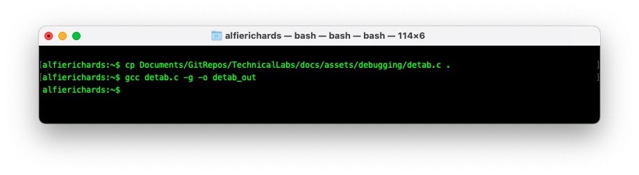
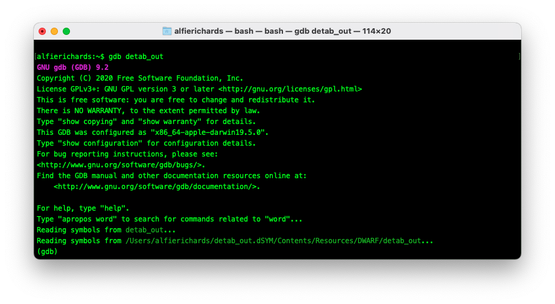
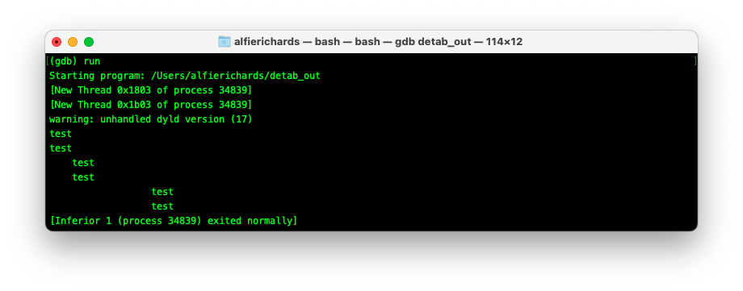
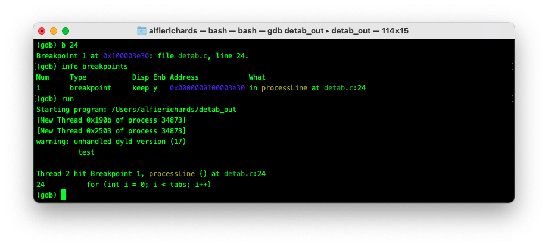
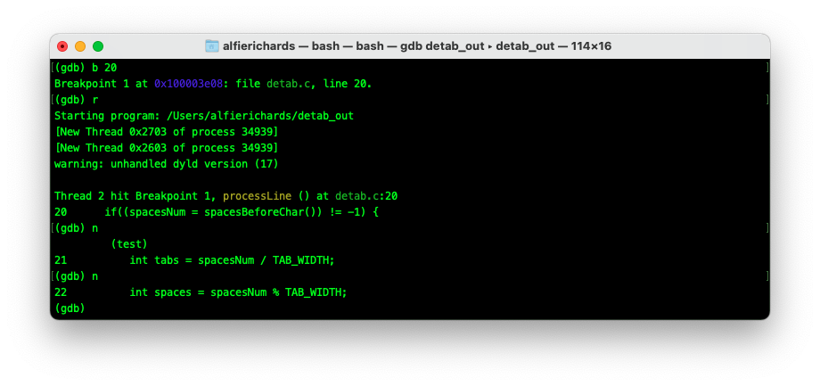
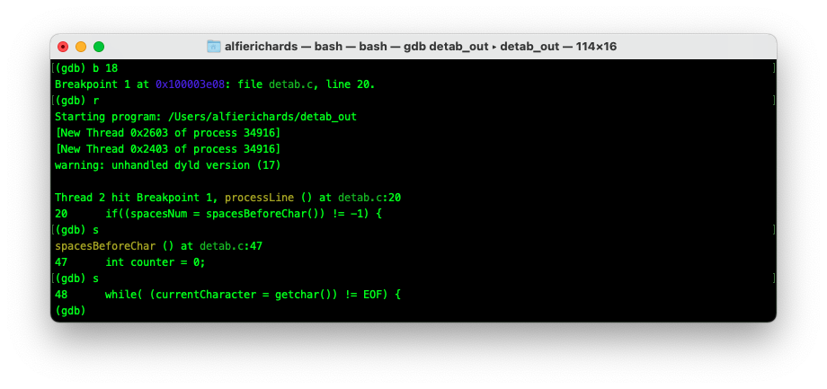
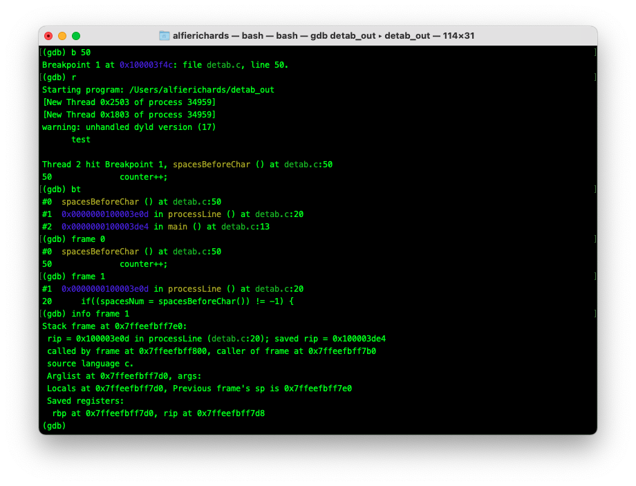
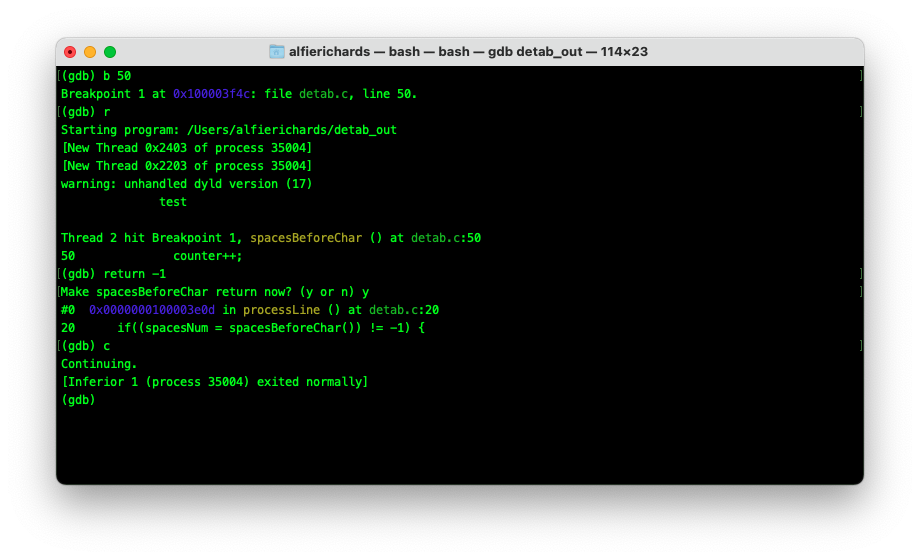

# Debugging

## Table of Contents

## Introduction

Debugging is the process of finding and fixing bugs in software. It may sound 
uninteresting but developers and computer scientists often spend just as much 
time debugging as they do writing code, so getting proficient and comfortable 
with debugging and the tools for doing it is important.

Debugging techniques fall into two categories. The first and most common is 
logging.

Logging is a technique that, if you've written much code at all, you're probably 
already familiar with. It involves littering your code with print statements, 
running the program over and over again, until eventually you track down your 
issue.

Logging is tried and tested, and nearly always works.

"The most effective debugging tool is still careful thought, coupled with 
judiciously placed print statements” — Brian Kernighan, Unix for Beginners.

But when logging isn't enough, you can turn to debuggers, which will be the 
subject of this lab.

### What is a debugger

A debugger is a program that gives you control over another program that you are 
trying to test or debug, allowing you to:

- Halt the execution of a program
- Step through a program line by line
- Inspect values of variables at any point
- Alter the execution of a program

As well as many more advanced features.

There is a massive selection of debuggers, and many languages provide their own. 
However, most debuggers have a similar command line interface. Most languages 
supported by a Jetbrains IDE have an almost identical GUI within the IDE.

To show you both the command line and the JetBrains interfaces, we are going to 
cover the command line in the notes and the JetBrains interface in the recorded 
live session.

For this lab we're going to be using [The GNU Project 
Debugger](https://www.gnu.org/software/gdb/) (**GDB** for short). GDB works with 
a number of languages - C, C++, Pascal, and Rust being some of the most popular. 
Here we will be using C as it is part of the Bath CS course.

### Installing GDB

Due to the privileges debuggers require in order to control another program, 
installation can be complicated. For Python and Java, debuggers come with the 
language development kits upon install, which no doubt you will have done 
already. For C debuggers it's more complicated. I recommend searching for 
instructions for your OS and desired debugger. However, CLion (the JetBrains C 
IDE) will come with one installed already.

## Opening GDB

Before you start up GDB you need to compile the C code of your program to be 
debugged, and include the `symbols table`. In brief, the `symbols table` 
correlates commands and addresses in a program's compiled binary with lines of 
source code and the names of variables in the source code. To do this specify 
the `-g` flag in the compiler.



**Note:** If you compile without the symbols table you will get an error and gdb 
won't work correctly. 

To open a binary with GDB use the command `gdb [binary file]`. GDB will open and 
present a prompt for your commands. The prompt will normally look like `(gdb)`.



In these examples I will be using this C file: 

`detab.c`:

```C
#include <stdio.h>

#define TAB_WIDTH 4

char currentCharacter;

int spacesBeforeChar();
int processLine();

int main() {

   while(processLine() != -1);

   return 0;
}

int processLine() {
    int spacesNum;
    if((spacesNum = spacesBeforeChar()) != -1) {
        int tabs = spacesNum / TAB_WIDTH;
        int spaces = spacesNum % TAB_WIDTH;

        for (int i = 0; i < tabs; i++) printf("\t");

        for (int i = 0; i < spaces; i++) printf(" ");

        do {
            printf("%c", currentCharacter);
            if(currentCharacter == '\n')
                return 0;
        } while ((currentCharacter = getchar()) != EOF);

        // While loop exited, thus EOF recieved
        return -1;
        

    } else {
        // Reached EOF while reading in spaces
        return  -1;
    }
}

int spacesBeforeChar() {
    int counter = 0;
    while( (currentCharacter = getchar()) != EOF) {
        if(currentCharacter == ' ') {
            counter++;
        } else {
            return counter;
        }
    }
    return -1;
}
```

This program converts input with spaces for indentation to one that uses tabs. I 
wrote it a long time ago while learning C. As a result it's not very well 
written, but it will work as an example here.

You can download the file [here](assets/debugging/detab.c) if you wish to play 
with it yourself.

### `run` command`

After loading a binary into GDB the `run [arguments]` command (or `r 
[arguments]`) runs the program.



## Breakpoints

To get GDB to halt at a certain line you need to insert a **breakpoint**. A 
breakpoint tells GDB to stop whenever it reaches a certain line. Once GDB has 
halted, you can enter commands to inspect or alter the program.

To insert a breakpoint use the command `break [line number]` 
(or `b [linenumber]`).

GDB will then print the name of the new breakpoint you've created. You can look 
at the list of current break points with `info breakpoints`.

You can also enable and disable the breakpoint with `enable [breakpoint number]` 
and `disable [breakpoint number]` respectively.

When you call `run` and the program gets to this line it will halt and the GDB 
prompt will open up to let you know it has hit the breakpoint.

You can look at the code around the breakpoint with the `list` command (or `l`), 
which lists 11 lines of code centred on the current line.



## Resuming execution

Once in a breakpoint you may want to continue execution of the program. You have 
a few ways to do this:

The `continue` (or `c`) command will resume execution until the next breakpoint 
is hit.

The `next` command (or `n`) will run until the line below the current line runs 
in the code. Often called **step over**.



The `step` command (or `s`) will run until the next line of code is reached. If 
the current line contains a function, this will then stop on the first line of 
that function. That is why this is often called **step into** as it will go into 
functions.



The `finish` (or `f`) command will run until the end of the current function, 
then will break and print the result.

The `until [line number]` command will run until execution reaches a certain 
line.

## Examining the stack

In C (and most programming languages) each time you perform a function call, 
information about the call is stored. This includes the location of the call, 
the arguments of the call, and the local variables of the function being called. 
This data is stored in a block called a **stack frame**. Stack frames together 
make up **the stack**.

### `bt (backtrace)` command

After you've halted in GDB you probably want to know where you are and how you 
got there. When you reach a breakpoint GDB will automatically select the 
executing stack frame. The `backtrace` command (or `bt`) will then print all the 
stack frames up until the main stack frame.

You can specify a `-[number]` flag to only print `number` stack frames.

### The frame command

With the `frame [frame number]` command you can then select any frame you want.
Or use `up` to go up one frame and `down` to go down one.

### Printing the contents of a frame

The `frame` command with no parameters prints a description of the frame. 

`info frame` prints a more verbose description.



### Finding variable values

You can also inspect the contents of variables at any point with `print 
[variable]`.

## Altering execution

You can now run through a program in a controlled way. However, you may want to 
change the course of execution. There are a couple of ways to alter the path of 
execution in your program. 

### `j(ump)` command

The first way is with the `jump [line number]` command (or `j`), which will jump 
to another line and resume execution there.

### `return` command

With the command `return [value]`, GDB will return from the current function 
with `value`. 



Here you can see I returned `-1` from the function, indicating that the function 
recieved an `EOF` character, resulting in the program exiting early.

### Assigning values to variables

You can alter execution by assigning different values to functions. To do this 
use the command `call [expr]` where the expression is an assignment to a 
variable. For instance, you could use the command `call foo=2` to set `foo` to 
2.

## Checkpoints

A more advanced feature that not all debuggers have is the ability to use 
checkpoints. The concept of checkpoints may be familiar from video games. 
Essentially, you can save the state of the program and can then later return to 
that state at any point to re-run something. In this way if you have a specific 
part of the program you wish to debug, you can save a checkpoint before it 
occurs, try something - if it fails return to the checkpoint, change some state, 
and try again.

To save a checkpoint use the command `checkpoint`. You can see a list of 
checkpoints with `info checkpoint` and restore to a checkpoint with `restart 
[checkpoint number]`.

## Watchpoints

Another more advanced feature some debuggers support is the concept of 
**watchpoints**. Watchpoints are similar to breakpoints but instead of breaking 
whenever a execution reaches a line of code, a watchpoint breaks every time a 
variable is changed.

To set a watchpoint use the command `watch [variable]`. Watchpoints can be 
enabled, disabled and deleted in the same way as breakpoints.

## Exceptions and crashes

One of the main uses of GDB and other C debuggers more generally is to allow a 
little more insight into C's errors and crashes. If your program receives a 
signal when running in GDB (for example, a `SIGSEGV`, or segmentation fault 
signal), the program will halt execution allowing you to examine where execution 
is at the point which your program is erroring. 

## Summary

Hopefully, you've seen some features of GDB that would have been useful in your 
debugging, or that you could imagine being useful in future debugging. On top of 
that, GDB has a massive number of features we couldn't cover here. I want to 
emphasise that while this lab used GDB, most languages have a variety of 
debuggers that work with them, and they will have a similar feature set - 
normally with a similar interface and commands.

Additionally, in the video for this week I have gone through the same feature 
set using the Jetbrains GUI in CLion, which may be easier if this is your first 
experience debugging.

## Sources

The bulk of the research for this lab was from the GDB manual which is open 
source and can be found [here](http://www.gnu.org/software/gdb/documentation/).

There will be good tutorials and introductions to any compiler you wish to learn 
online. You will also learn a lot from use.

## Credit and thanks

Written by [Alfie Richards](https://www.alfierichards.com)

Edited by [Joe Cryer](mailto:jcryer1234@gmail.com)

Additional help from:

- [Søren Mortensen](https://neros.dev)
- Dr Russell Bradford

