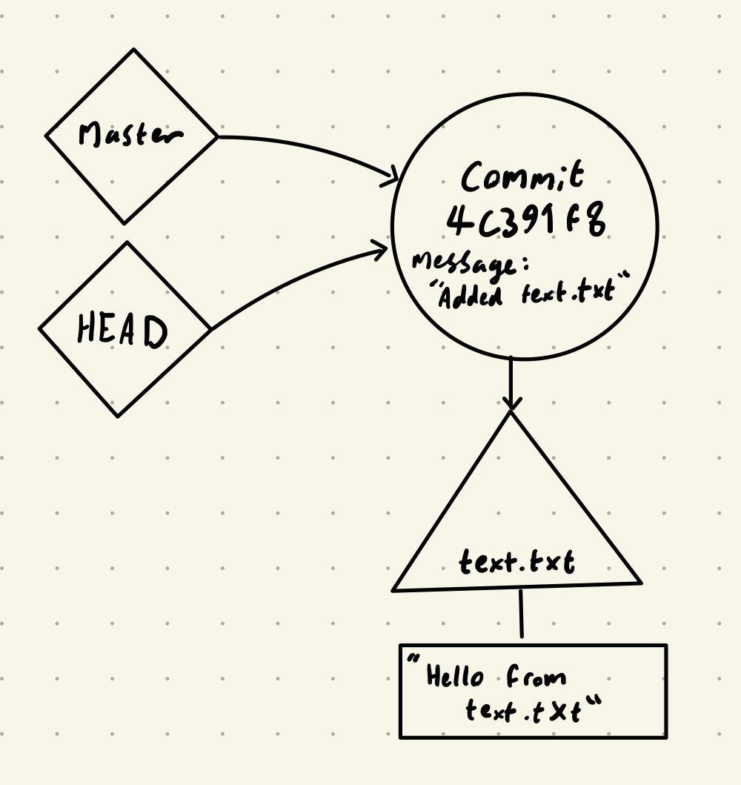

# [Git](https://git-scm.com/)

## Table of Contents

1. [Introduction](#introduction)
    1. [Version control generally](#version-control-generally)
    2. [Learning Git](#learning-git)
    3. [Installing Git](#installing-git)
2. [The Git Data Model](#the-git-data-model)
    1. [Objects](#objects)
    2. [Data model as pseudocode](#data-model-as-pseudocode)
    3. [Data model diagrammatically](#data-model-diagram)
    4. [Storing objects](#storing-objects)
    5. [Commit structure](#commit-structure)
    6. [Repositories](#repositories)
    7. [The Index](#the-index)
3. [How to use Git](#how-to-use-git)
    1. [The Git command line interface](#the-git-command-line-interface)
    2. [Making a Git repository](#making-a-git-repository)
    3. [Commands](#commands)

## Introduction

Git is the most popular version control tool for Computer Scientists and is extremely widely used. We're going to run through the basics of how Git works and how to use it, so you can effectively use Git for your own projects!

We will be covering Git's data model and how to use Git locally on your machine in this lab. Using 
remotes such as GitHub will be covered in the next lab. However, I recommend you don't skip this session 
as the Git remote session will not make sense without lots of the knowledge from this one.

### Version control generally

Version control systems are used to track changes in files as you work on them. These tools help you to maintain a history of your changes and keep your work organised.

This is useful even when working on your own - it lets you look at different snapshots of projects and compare changes you made. For each change you make, you can submit an overview of the change - this gives you a great log to look back on different development decisions. Git also easily facilitates parallel branches of development to try out different ways of doing something.

When working with other people, Git stops being useful and starts being vital. Git allows for multiple people to have access and submit changes to a shared repository in a controlled manner. It's an invaluable tool that lets teams see what changes other people have made, to resolve development conflicts.

### Learning Git

Git can be very hard to learn properly, whether you're using a GUI or the command line. Git is a 'leaky abstraction', so learning it top-down by using it doesn't give you a great understanding of what is actually happening. These difficulties are magnified by the fact that misleading or incorrect information on Git is irritatingly common across the internet.

In this lab we aim to introduce Git from the ground up. Git itself is based on a very elegant data structure, there is just a rather ugly interface sitting on top of it that can be very confusing.

### Installing Git

Follow the guides [here](https://github.com/git-guides/install-git) to find how to install Git on 
your machine.

You can also install a GUI for Git, but for this tutorial we will be using the command line to demonstrate what the Git commands are doing.

## The Git data model

### Objects

There are 4 basic objects in the Git data model that everything revolves around:

- Blobs
- Trees
- Commits
- Tags

#### Blob

A blob (or **b**inary **l**arge **ob**ject) is common Computer Science terminology for a collection 
of binary data. Git uses blobs to store the data for each file in your repository, but not any of the 
metadata (like file path, file name, file type) - that data is stored in trees.

#### Tree

A tree represents one directory in your repository. It stores the metadata of the files in the directory (file path, file name, file type), as well as the addresses to the blobs that contain the data of each of these files. Trees can also contain other trees (subdirectories). 

#### Commit

A commit represents a snapshot of your repository. It stores the name of the author of the snapshot, 
an array of parent commits that this commit inherits from (usually just one), and a message from the author 
saying what changes have happened between this commit and the parent commits.

#### Tags

Tags allow Git users to label specific commits of interest. For instance, you will have labels for 
the different branches in the repository, and you may have one representing "V1.3.25" of the project 
so that you can come back to it later. A tag simply stores its name, and the commit it refers to.

### Data model as pseudocode

We can write some pseudocode to represent this structure. This code is not any 
particular language.

```
//  A blob stores the data of an individual file
type blob = array<bytes>

//  A tree contains a dictionary with the file names for all the items in a directory linked to the 
//  Git object storing their data
type tree = map<string, tree | blob >

type commit = struct {
    parent: array<commit>
    author: string
    message: string
    snapshot: tree
}

type tag = struct {
    name: string
    commit: commit
}
```

### Data model diagram

We can also represent Git's data model diagrammatically, and there is common syntax for this.

- A blob is a rectangle
- A tree is a triangle
- A commit is a circle
- A tag is a diamond

Here is a diagram representing a commit of this file structure:

```
    /repository
    |
    |- /folder1
    |  |
    |  |- text1.txt
    |
    |- text2.txt
```

{:.smallImg}

### Storing objects

"But how are the objects stored?" I hear you ask. All four object categories are stored in a single large dictionary 
creatively named the "object store". The key to each object is the SHA1 hash of that object's contents.

If you aren't familiar with hashing, here are the basics: you take some data, run it through an 
algorithm that produces a semi-random value (in this case an 160 bit binary string) that is used to represent the 
input data. Vitally, the hashing algorithm will always produce the same semi-random value when given the same data.

Due to the number of possible 160 bit binary strings you can assume that a SHA1 hash of any data is unique.

Git uses these hashes to identify each object. Objects then refer to other objects with the hash 
string. For example, a commit doesn't contain the tree, but instead contains the hash of the tree which 
can then be looked up in the object store.

### Commit structure

There is some extra structure to how the commits relate to each other. Commits have to form a "Directed Acyclic Graph". This is a fancy way of saying all commits have parents they inherit from, and you can't form cycles.

**Note:** Each commit references its parents rather than the parent commits referencing their children. So, in a diagram representing a commit graph, all arrows should flow from the commits to 
their parents. From the perspective of the development flow this is counterintuitive, but it makes sense once you understand how commits relate to each other in Git. If you 
see a diagram with the arrows the other way around be wary of that source of information.

{:.smallImg}

**Note:** Commits do not store the changes that have been made since the parent commit. Rather, they store the entire contents of the repository at the time of the snapshot. When the differences between commits are displayed, they are generated by comparing the entire contents of the different commits. This is different to most other version control solutions, but allows Git to do many powerful things. Git also has some clever storage techniques that mean repeated data is only stored once, so don't worry about the storage implications of this design decision.

### Repositories

Finally we can define a "repository" in Git: it is the collection of objects and references.

There is a single `.git` directory in each repository that stores the data for that repository. The rest of the directory is your "working directory" to view files and make changes. Git can be used to keep track of those changes within this working directory. 

### The Index

There is one more addition to our model - "staging". In Git you stage files before committing them.

The mechanism for this is the Index. The Index is simply a tree object that is not yet in the object store. As changes are being made (when you stage files), the Index is updated. When you commit these changes, the Index is hashed and stored in the object store. 

Files in a Git repository fall under 3 categories:

1. Ignored - If a file path is in the `.gitignore` file then Git will ignore it. A common use of this 
   is to ignore compiled files of your code.
2. Tracked - A tracked file is a file already in previous commits or currently staged in the Index.
3. Untracked - An untracked file falls into neither of the last two categories. Git will ignore 
   these files unless you add them, and will warn you about untracked files in the `git status` 
   response.

## How to use Git

Now we've got the Git data structure, it's time to start using it!

We will be using the Git command line interface. There are GUI alternatives that often come with IDEs by default, but unfortunately they add another layer of abstraction to a program that already 
bewilders lots of its users - I don't recommend them for beginners.

**Note:** In this section all the examples will be performed one after the other on one repository, so the changes will move from 
one example to the next. You can follow along with your own repository if you like.

### The Git command line interface

The Git command line interface works with a series of commands. Each command is structured as such:
```
git <command> [parameters...]
```

Git takes the first parameter to specify the command you want to run, then passes the rest of the 
parameters to that command.

### Making a Git repository

To make a local repository make a folder for it then navigate to it in your
terminal shell. Then run `git init`.

This creates the `.git` folder to store all the information Git requires.


Note the `.git` directory has now appeared.

### Commands

We will now run through some of the most common git commands, these commands make up a solid 
workflow for working on a local repository.

#### git status

`git status` is a very useful tool. It quickly shows you the state of your repository and has a bunch 
of flags to display other useful information. I recommend you get comfortable with it.


It's not very useful without any files or commits yet.
One of the many useful things `git status` will do is list all the files in the untracked state, and 
all the staged changes in the Index ready to be committed.

#### git add

Before Git does anything to your files you need to "stage" them to make Git
aware of them.

To add a file to the Index run `git add <file>`.


#### git commit

Once you've staged a file you can commit them.

To commit the changes to the repository run `git commit`. You will then be prompted to write a 
message describing the commit. Alternatively use `git commit -m "<message>"` to commit with a 
message in one command.


Git often prompts you for input and to do so it will use the text editor set in your configurations. 
By default this is Vim, which is hard to use for beginners. To change the default text editor use 
the command `git config --global core.editor <editor-of-choice>`. For beginners I suggest setting 
`nano`. 

**Note:** To exit Vim press the `:` key then `Q`.

You may be wondering what the `4c391f8` in the `git status` is. That is the first 7 hexadecimal digits 
of the SHA1 hash that represents the commit in the object store. You can use these 7 digits as an 
identifier for the commit as they will almost always be unique and Git will automatically find the 
matching commit.

We can now think about how the commit structure will look.

{:.smallImg}

The "master" tag is the tag for the default branch - it's increasingly called "main" instead. The 
"HEAD" tag represents where you currently are, i.e. which commit is "checked out". 

#### git log

To see the commits in the repository use the `git log` command. You can also use the `--oneline` 
flag to have one line per commit, and the `--graph` flag to get a graphical representation of the commits.

**Note:** By default the Git log opens in a pager, which you would press the `Q` key to exit. 
I'm adding the 
`--no-pager` flag to make it easier to show examples, but I wouldn't recommend this in normal use, as logs can be very long.


Git logs are much more useful with more commits, so I'm going to add some more.


Here you can see I used the `--oneline` flag to make the output nice and compact.

#### git diff

Git diff is very similar to the Unix command `diff` in that it finds and shows the differences 
between files. 

`git diff` can be used in multiple ways:

- `git diff` compares between the current working directory and the Index, i.e. your current staged changes.
- `git diff <commit>` compares your current working directory and the specified commit.
- `git diff <commit> <commit>` compares two commits.
- `git diff --cached <commit>` compares the Index to a commit.


#### git branch

Git branch lets you create a new branch head at the currently checked out commit.

Use the command `git branch` to list all the branches, and `git branch <name>` to create a new 
branch. 


Here the asterisk represents the current branch.

The project structure now looks like this:

{:.smallImg}

#### git checkout

You may have noticed we're still on the master branch! Before we add anything to the new branch we 
need to check it out. To do this use the `git checkout <branch>`. 


Here you can see I checked out new_branch, made a change and committed it, then checked out master, 
made a different change and committed it. 

To see these commits we can use `git log`.


Here you can see I've used the `--graph`, `--oneline`, and `--all` flags, so that it displays in an 
easily understandable way. You can look at the `git log` documentation to further understand what 
these flags do.

You can also see the different tags on each branch, representing the heads of each branch and `HEAD` 
for where is currently checked out.

You can also checkout specific commits with `git checkout <commit>` although making any changes 
leads to confusion. It's best to only checkout old branches to look at the content and make new 
branches from there.

#### git merge

What if we now want changes from both branches in one branch? This is where a merge happens! Any 
commit that inherits from more than one other commit is a merge. 

To do a merge, first checkout the branch you want to merge **into**. Next, use the command
`git merge <branch>`, where `<branch>` is the branch you want to merge into the branch you currently 
have checked out. Git will prompt you for a name for the new commit. That new commit will inherit 
from the two merging branches with the changes from both.

If each branch has been working on different sections of the files being merged, 
Git will automatically merge them. However, if changes have been made to the same sections you will have 
a "merge conflict" which will have to be resolved manually. Resolving merge conflict is outside the 
scope of this lab.


#### git tag

You can also add your own tags to commits. Do this by using `git tag <tagname> <commit>` or use 
`git tag <tagname>` to tag your current commit. Then use `git tag -d <tagname>` to delete a tag.

You can checkout tags with `git checkout <tagname>`.


#### git help

To find out more about any command, its available flags or a description of the command, you can 
always use the command `git help <command>`. This will display a manual page for that specific 
command. Again exit the page with the `Q` key.

In addition `git help` will list all available commands.

## Learn More!

This was a very brief introduction to Git. If you want to learn more I recommend you read 
[this book](https://learning.oreilly.com/library/view/version-control-with/9781449345037/). It's an 
O'Reilly book on Git and it covers everything we've covered in much more detail. All CS students at 
the University of Bath get an O'Reilly subscription so you can access the book for free.

There is also much more material online, but be careful - misleading or incorrect advice on Git is 
widespread, so it's better to learn formally from trusted literature. Trust me, you will save yourself 
a lot of time and headaches by learning Git the right way!

Other recommended learning resources:

- [Pro Git](https://git-scm.com/book/en/v2) is an often recommended introduction to Git.
- [Oh shit, Git!?!](https://ohshitgit.com/) is a short guide on how to recover from some common Git mistakes.
- [Git for Computer Scientists](https://eagain.net/articles/git-for-computer-scientists/) is a short
    explanation of Git's data model.
- [Git from the bottom up](https://jwiegley.github.io/git-from-the-bottom-up/) is a detailed 
    explanation of Git's implementation details beyond the data model, for those who are curious.
- [Version Control (Git)](https://missing.csail.mit.edu/2020/version-control/) is the notes from the series this is based on.

### Exercises

1. Read through the first few chapters of Pro Git.
2. Make a repository and add some files and commits.
3. If you have any small projects, like a CV or coursework, try using Git for it. **Warning:** if you 
   aren't comfortable with Git do make periodic backups somewhere else, just so you don't lose your 
   work.
4. Play [this game](https://learngitbranching.js.org/) intended to teach git branching.

## Credit and thanks

Written by [Alfie Richards](mailto:alfierchrds@gmail.com)

Edited by [Joe Cryer](mailto: jcryer1234@gmail.com)

Additional help from:
- Dr Russell Bradford
- Bence Babrián
