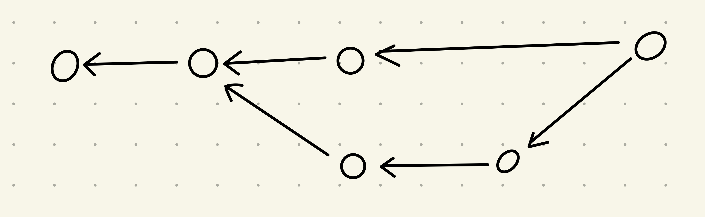
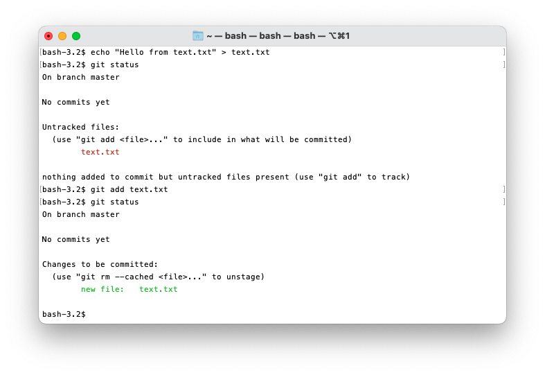
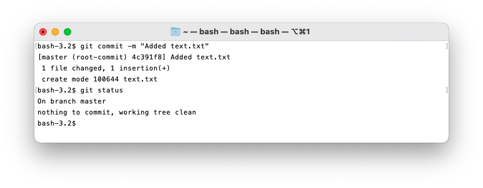
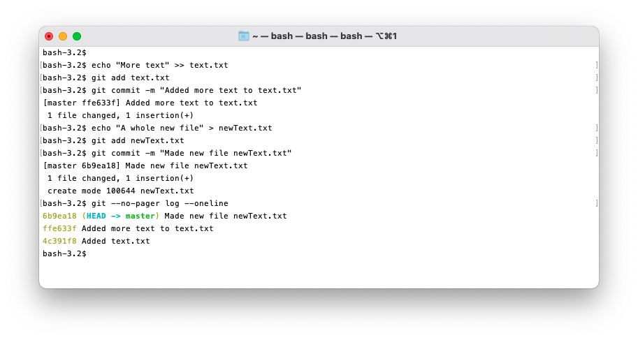
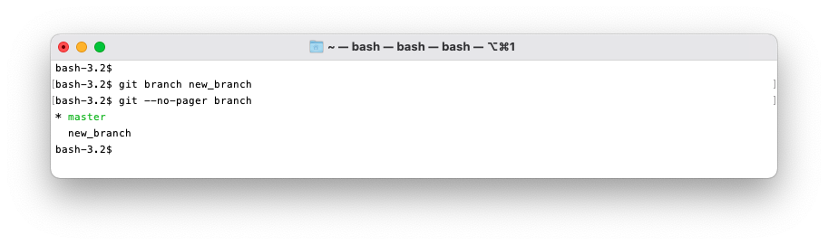
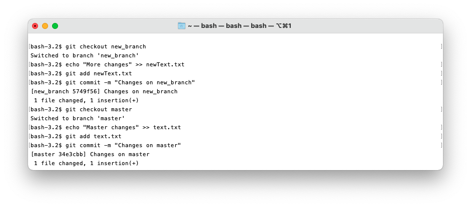
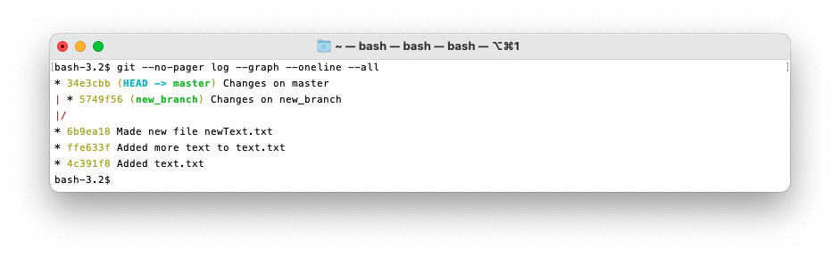
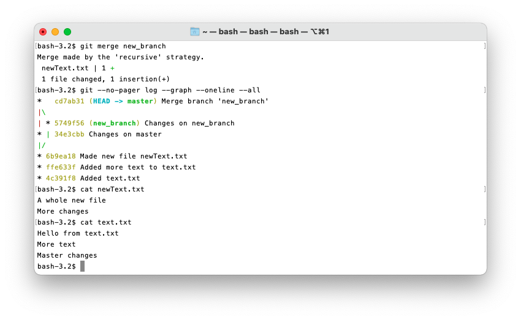

# [Git](https://git-scm.com/)

## Table of Contents

1. [Introduction](#introduction)
    1. [Version control generally](#version-control-generally)
    2. [Learning git](#learning-git)
    3. [Installing git](#insalling-git)
2. [The Git Data Model](#the-git-data-model)
    1. [Objects](#objects)
    2. [Data model ad pseudo code](#data-model-as-pseudo-code)
    3. [Data model diagramatically](#data-model-diagramatically)
    4. [Storing objects](#storing-objects)
    5. [Repositiories](#repostiories)
    6. [The index](#the-index)
3. [How to use git](#how-to-use-git)

## Introduction

Git is the most popular version control tool for Computer Scientists and is
used extremely widely. We're going to run through how git works and the basics of using git so you
can use it for your own projects and can learn the more yourself!

We will be covering git's data model and using git locally on your machine in this lab, using 
remotes such as github will be covered in the next lab. Howver, I recommend you dont skip this lab 
as the git remote lab will not make sense without lots of the knowledge from this lab.

### Version control generally

Version control systems are used to track changes in files as you work on them. These tools help 
maintain a history of your changes and help keep your work organised.

This is useful if youre working by yourself, it lets you look at old snapshots of projects and 
compare old changes. It also lets you maintain resons for each change and fascilitates parallel 
branches of development.

Git changes from useful to vital in collaboration. Git allows for multiple people to have access to 
and submit changes to a shared repository in a controlled manner. It's an invaluable tool for teams 
seeing what other people have changed and resolving development conflicts.

### Learning git

Git is really hard to learn from use, wether you're using a GUI or the command line git is a leaky 
abstraction, this makes learning git top-down from use unenlightening. Also missleading or incorrect 
information on git is irritatingly common.

In this lab aims to intoduce git bottom-up. Git is based on a very elegant data structure, the 
confusion comes from the rather ugly interface on top of that.

### Installing git

Follow the guides [here](https://github.com/git-guides/install-git) to find how to install git on 
your machine.

You can also install a GUI for git, but for this tutorial we will be using the command line to try 
demonstrate what git commands are doing.

## The Git data model

There are 4 basic objects in the git data model:

- blobs
- trees
- commits
- tags

Everything revolves around these 4 simple objects.

### Objects

#### Blob

A blob (or **b**inary **l**arge **ob**ject) is common computer science terminology for a collection 
of binary data. Git uses blobs to store the data for each file in your repsitory, but not any of the 
meta data, like file path, file name, file type, that data is stored in tree's.

#### Tree

A tree represents one directory in your repository. It stores the names and file paths of the 
contents of the directory, and the address of either the tree or the blob representing each item in 
git.

#### Commit

A commit represents a snapshot of your repostiory. It stores the name of the author or the snapshot, 
an array of parent commits that this commit inherits from (usually 1), a message from the author 
saying what changes have happened between this commit and the parent commits.

#### Tags

Tags allow git users to label specific commits of interest. For instance you will have labels for 
the different branches in the repository, and you may have one representing "V1.3.25" of the project 
so that you can come back to it later. A tag simply stores it's name, and the commit it refers to.

### Data model as pseudo code

With this structure we can write some pseudo code to represent this structure. This code is not any 
particular language, it just represents the structure.

```
//  a blob stors the data of an individual file
type blob = array<bytes>

//  a tree contains a dictionary with the file names for all the items in a directory linked to the 
//      git object storing their data
type tree = map<string, tree | blob >

type commit = struct {
    parent: array<commit>
    author: string
    message: string
    snapshot: tree
}

type tag = struct {
    name: string
    commit: commit
}
```

### Data model diagramatically

We can also represent gits data model diagramatically, and there is common syntax for this.

- A blob is a rectangle
- A tree is a triangle
- A commit is a circle
- A tag is a diamond

Here is a diagram representing a commit of this file structure:

```
    /repository
    |
    |- /folder1
    |  |
    |  |- text1.txt
    |
    |- text2.txt
```

{:.smallImg}

### Storing objects

"But how are the objects stored?" I hear you ask. Objects are stored in a large dictionary 
creatively named the "object store". The key to the objects is the SHA1 hash of the objects 
contents.

If you aren't familiar with hashing the basics is that you take some data, run it through an 
algorithm that produces a semi-random value, in this case an 160 bit binary string, to represent the 
input data. But, vitally, for the same data the hash produces the same value each time. 

Because of the number of possible 160 bit binary strings you can assume that a SHA1 hash of any data 
is unique.

Git uses these hash's to identify each object. Objects then refer to other objects with the hash 
string. For example a commit doesn't contain the tree, instead it stores the hash of the tree which 
can then be looked up in the object store.

### Commit structure

There is some extra structure to how the commits relate to each other. Commits have to form a 
"Directed Acyclic Graph". This is a fancy way of saying all commits have parents they inherit from, 
and you can't form cycles.

It is important to note that each commit refrences its parents, the parent does not refrence its 
children. So in a diagram representing a commit graph any arrows should flow from the commits to 
their parents, which is counter intuative from the peerspective of the flow when developing. If you 
see a diagram the arrows the other way around be very sceptical of that source of information.

{:.smallImg}

It is also to note a way git differs from most other version control solutions. Each commit and its 
associated snapshot store the entire content of the repository, not the changes from the parent 
commits, when you display the differences in one snapshot to the next those are generated 
algorithmically. This allows git to do many powerful things alternative solutions can't. Git also 
has some clever storage techniques that mean repeated data is only stored once, so don't worry about 
the storage implications.

### Repositories

Finally we can define a "repository" in git, it is the collection of objects and refrences.

There is a single .git directory in each repository that stores all the state for git, the rest of 
the directory is your working directory to view files and make changes, git can be used to keep 
track of those and files and subdirectories within this working directory. 

### The index

There is one more addition to our model, "staging". In git you stage files before commiting them.

The mechanism for this is the index. The index is simply a tree object, but git has some special 
logic for it. Before you make any changes the index contains the tree of the last commit. Then when 
you stage files, either new files or modified fiels, it updates the index with these changes. Then 
when you commit it simply adds a commit pointing to the current index tree.

Files in a git repository fall under 3 categories:

1. Ignored - If a file path is in the .gitignore file then git will ignore it. A common use of this 
   is to ignore compiled files of your code.
2. Tracked - A tracked file is a file already in the repository or staged in the index.
3. Untracked - An untracked file falls into neither of the last two categories. Git will ignore 
   these files unless you add them, and will warn you about untracked files in the git status 
   response.

## How to use git

Now we've got the git data structure, time to start using it!

We will be using the git command line interface. There are GUI alternatives, often coming default 
with IDE's, but they unfortunately add another layer of abstraction to a program that already 
bewilders lots of its users, I dont recommend them for beginners.

In this section all the examples will be sequential on one repository, so the changes will move from 
one example to the next. You can follow along with your own repository if you like.

### The git command line interface

The git command line interface works with a series of commands. Each command is structured as such:
```
git <command> [parameters...]
```

Git takes the first parameter to specify the command you want to run, then passes the rest of the 
parameters to that command.

### Making a git repository

To make a local repository make a folder for it then navigate to it in your
terminal shell. Then run `git init`.

This adds the .git folder to store all the state information git requires.


Note the `.git` directory.

### Commands

#### git status

Git status is a very useful tool. It quickly shows you the state of your repository and has a bunch 
of flags to display other useful information. I recommend you get comfortable with it.


It's not very useful without any files or commits yet.
One of the many useful things git status will do is list all the files in the untracked state, and 
all the staged changes in index ready to be committed.

#### git add

Before git does anything to your files you need to "stage" them to make git
aware of them.

To add a file to the index run `git add <file>`.



#### git commit

Once you've staged a file you can commit them.

To commit the changes to the repository run `git commit` upon which you will be prompted for a 
message describing the commit, alternatively use `git commit -m "<message>"` to add the message in 
line.



You may be wondering what the `4c391f8` in the git status is, that is the first 7 hexadecimal digits 
of the SHA1 hash that represents the commit in the object store. You can use these 7 digits as an 
identifier for the commit as they will almost always be unique and git will automatically  find the 
matching commit.

We can now think about how the commit structure will look.

{:.smallImg}

The "master" tag is the tag for the default branch, it's increasingly called "main" instead. The 
"HEAD" tag represents where you currently are, aka which commit is "checkedout". 

#### git log

To see the commits in the repository use the `git log` command. you can also use the `--oneline` 
flag to have one line per commit, and the `--graph` flag to get a graphical representation of the 
commit graph.

By default the git log opens in a pager, which you would press the `Q` key to exit. I'm adding the 
`--no-pager` flag to make it easier to show examples, but I wouldnt recommend this in normal use, as 
logs can be very long.


Git logs are much more useful with more commits, so I'm going to add some more.



Here you can see I used the `--oneline` flag to make the output nice and compact.

#### git diff

Git diff is very similar to the Unix command `diff` in that it finds and shows the differences 
between files. 

`git diff` can be used in multiple ways:

- `git diff` to compare between the current working directory and the index, aka your current staged 
    changes
- `git diff <commit>` compares your current working directory and the specified commit.
- `git diff <commit> <commit>` compares two commits.
- `git diff --cached <commit>` compares the index to a commit.


#### git branch

Git branch lets you greate a new branch head at the curent checked out commit.

Use the command `git branch` to list all the branches, and `git branch <name>` to create a new 
branch. 



Here the asterisk represents the current branch.

The project structure now looks like this:

{:.smallImg}

#### git checkout

You may have noticed we're still on the master branch! Before we add anything to the new branch we 
need to check it out. To do this use the `git checkout <branch>`. 



Here you can see I checked out new_branch, made a change and comitted it, then chacked out master, 
made a different change and comitted it. 

To see thse commits we can use a git log.



Here you can see I've used the `--graph`, `--oneline`, and `--all` flags, so that it displays in a 
easily understandable way. You can look at the git log documentation to further understand what 
these flags do.

You can also see the different tags on each branch, representing the heads of each branch and `HEAD` 
for where is currently checked out.

You can also checkout specific commits with `git checkout <commit>` although making any changes 
leads to confusion. So its best to checkout old branches only to look at the content and to make new 
branches from there.

#### git merge

What if we now want changes from both branches in one branch, this is where a merge happens! Any 
commit that inherits from more than one other commit is a merge. 

To do a merge first checkout the branch you want to merge *into*, then use the command
`git merge <branch>` where `<branch>` is the branch you want to merge into the branch you currently 
have checked out. Git will prompt you for a name for the new commit. that new commit will inherit 
from the two merging branches with the changes from both.

Most of the time, if each branch has been working on different sections of the files to be merged, 
git will automatically merge them. But if changes have been made to the same sections you will have 
a "merge conflict" which will have to be resolved maually. Resolving merge conflict is outside the 
scope of this lab.



#### git tag

You can also add your own tags to commits. Do this by using the `git tag <tagname> <commit>` or use 
`git tag <tag_name>` to tag your current commit. Then `git tag -d <tagname>` to delete a tag.

You can checkout tags with `git checkout <tagname>`.


## Learn More!

This was a very brief introduction to git. If you want to learn more I recommend you read 
[this book](https://learning.oreilly.com/library/view/version-control-with/9781449345037/). Its an 
O'Rilley book on git and it covers everything we've covered im much more detail. All CS students at 
the University of Bath get an O'Rilley subscription so you can access the book for free.

There is also much more material online, but be careful. Missleading or incorrect advice on git is 
widespread. It's better to learn formally from trusted literature. Trust me, you will save yourself 
a lot of time and headaches by learning git properly!

Other recommended learning resources:

- [Pro Git](https://git-scm.com/book/en/v2) is an often recommended introduction to git.
- [Oh shit, Git!?!](https://ohshitgit.com/) is a short guide on how to recover from some common git 
    mistakes,
- [Git for Computer Scientists](https://eagain.net/articles/git-for-computer-scientists/) is a short
    explanation of git's data model.
- [Git from the bottom up](https://jwiegley.github.io/git-from-the-bottom-up/) is a detailed 
    explanation of Gits implementation details beyond the data model, for those who are curious.
- [Version Control (Git)](https://missing.csail.mit.edu/2020/version-control/) is the notes from the 
    series this is based on.

### Exercises

1. Read through the first few chapters of Pro Git.
2. Make a repoitory and add some fiels and commits.
3. If you have any small projects, like a CV or coursework, try using git for it. **Warning** if you 
   arent comfortable with git do make perodic backups somewhere else, jsut so you dont lose your 
   work.
4. Play [this game](https://learngitbranching.js.org/) intended to teach git branching.
