# Git, the sequel

## Table of Contents

1. [Git remotes](#git-remotes)
2. [GitHub example](#github-example)
3. [Collaboration best practices and techniques](#collaboration-best-practices-and-techniques)
4. [Resolving merges](#resolving-merges)
5. [Pull requests](#pull-requests)
6. [Exercises](#exercises)

## Git remotes

Having a repository for storing your work is only half the story; you may want 
to back up your work, or share it with others. For this purpose Git has 
"remotes". Any Git repository can be a remote or have remotes it connects to (or 
both at the same time). Git's remote system is very flexible. 

### What is a remote

A remote is simply another git repository. Because git is a _distributed_ 
version control system, each git repository is a full, independent copy that is 
able to send and recieve commits to and from others. These may be other 
repositories on the same system, or on another computer on the local network, or 
(most commonly) on a server accessed over the internet.

A local repository can "push" commits to a remote, or "fetch" and "pull" commits 
from a remote.

There are many methodologies for structuring remotes, but the most common is to 
have each developer in a team have a local repository on their device and one 
bare remote repository for them to collate their work on.

**Terminology:** Git doesn't care about the structure of remotes, but by 
convention we say the flow of changes from development machines to the remote 
repository is called "upstream". Then the flow of changes from the shared remote back 
to the development machine is called "downstream". In this way we can say a development 
machine is downstream of the remote.

### How interacting with a remote works

When you set up a remote for your local repository you it a name, as the 
repository can have multiple remotes). The most common name is **origin**. The 
state of the remote is then represented on **remote tracking branches**. This is 
a one-way relationship where each local branch can be associated with, or 
"track", a remote branch, which is the designated branch for it to push and pull 
commits to and from. In almost all cases, the local branch and the remote branch 
will have the same name.

To get a local repository with a remote you must either clone an existing remote 
repository or add a remote to an existing local repository. To clone a remote 
repository use the command `git clone <remote repo URL> [name]`. This will make 
a new folder called `[name]` containing the copied repository. To add a remote 
to an existing local repository use the command 
`git remote add <remote name> <remote URL>`. These will be expanded upon later, with the example of GitHub.

To retrieve commits from a remote to your local repository you use `git fetch 
[remote_name]`. The remote can be omitted if it's the only one configured in the 
local repository. This command will retrieve the objects from the remote 
repository and represent the commits on remote tracking branches.

Remote tracking branches are functionally the same as remote branches except 
they are named like `remotes/<remote name>/<remote branch name>`, and they are 
automatically generated on a fetch to represent the state of the branches on the 
remote. To bring changes into your local repository branches you merge the remote 
tracking branches into your local branches. 

**Note:** You should never work directly on the remote tracking branches - it 
causes a lot of headaches.

To push your work to a remote, you use the command `git push [remote]` which 
will push the current branch to the configured remote branch.

However, if you've made a new branch in your local Git repository, Git will not 
know which branch on the remote to add your changes into, or it may need to make 
a new one. To correlate local branches with branches on remotes Git uses 
something called a **refspec**. These are configurations within your Git 
repository which tells Git what remote branch you wish for the local branch to 
update and pull from. The most common way to add a refspec is to add the `-u` 
flag to your push command. This will add a refspec for your checked out local 
branch to a remote branch of the same name. The whole command is then 
`git push -u <repository> <branch>`.

After refspecs have been configured you can use the `git pull [remote]` command 
which will fetch all commits from the remote, add them to the remote tracking 
branches, then merge them into the local branches specified in the refspecs.

## GitHub example

GitHub is the most popular host for remotes. GitHub hosts remote Git 
repositories and manages access to them. With GitHub you can control which users 
can pull your repository and which can push changes to it.

For example, let's use a local Technical Labs repository. Here you can see it 
with a long history. 

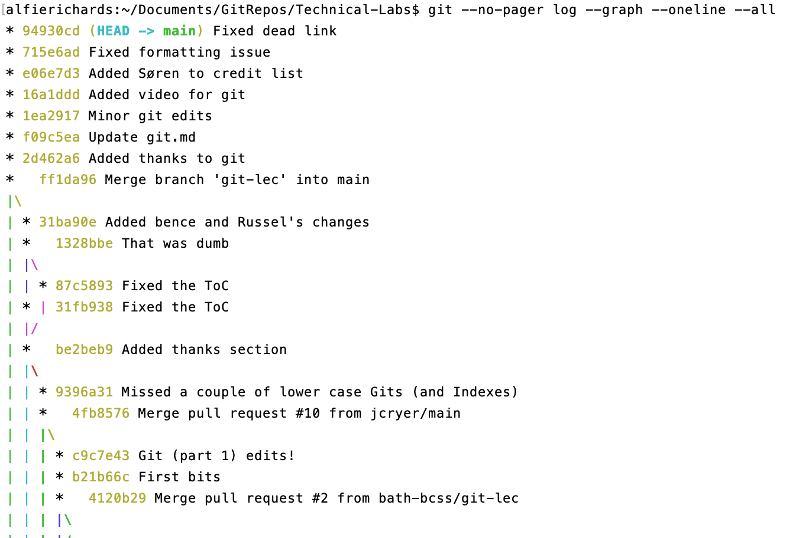

The command `git remote` lists the current remotes. Here you can see there are 
no current remotes (I removed them for this example).

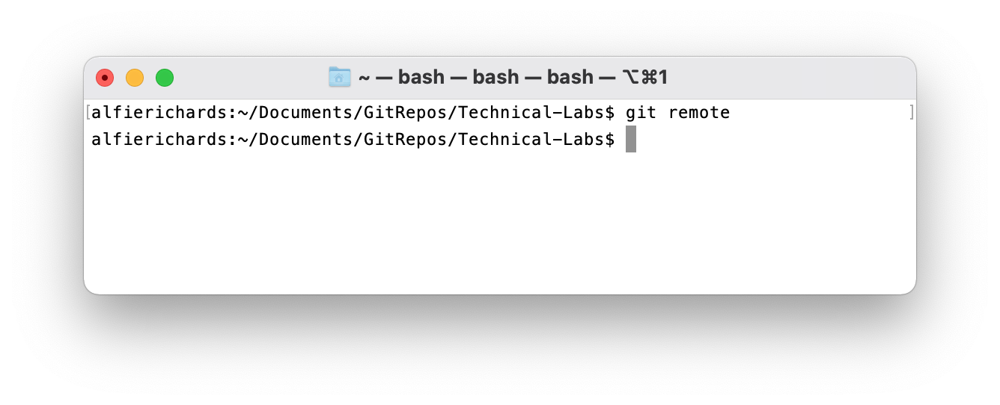

We then need to set up a repository on GitHub. To do this first set up an 
account if you don't already have one. Then you need to click the **+** button 
at the top right, and then "New Repository" in the drop down.

You will be presented with some options for setting up a new repository. Here 
I'm going to enter details for a new GitHub repository for Technical Labs.

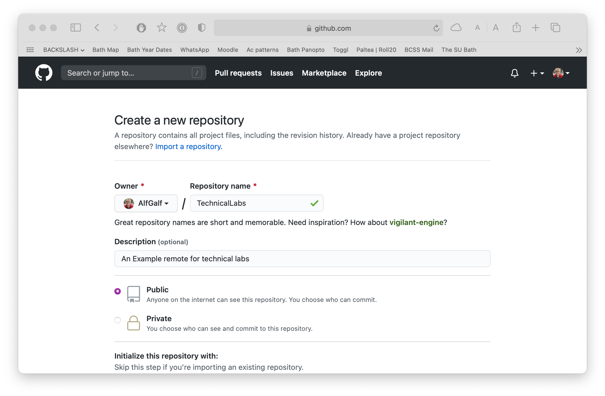

Click confirm and then you will be presented with the following screen showing 
your new empty repository.

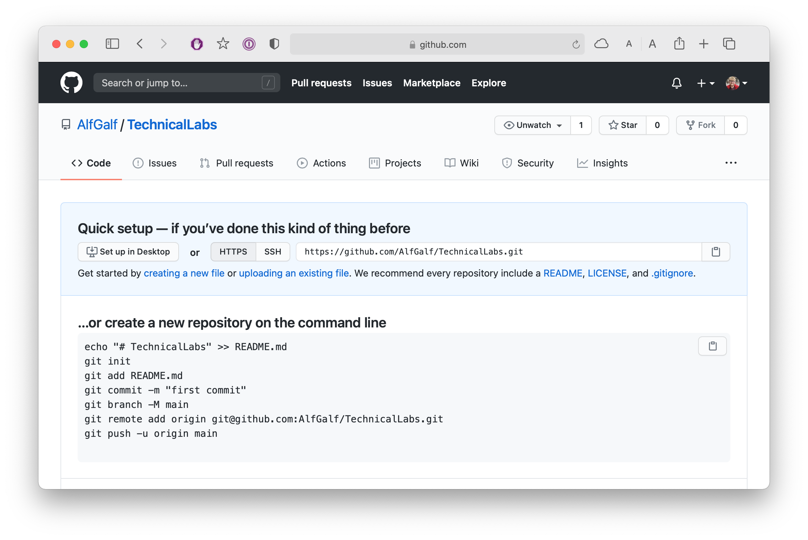

The address at the top is the address for the remote that has just been set up 
that GitHub is now hosting. We can now add the remote to the local repo.

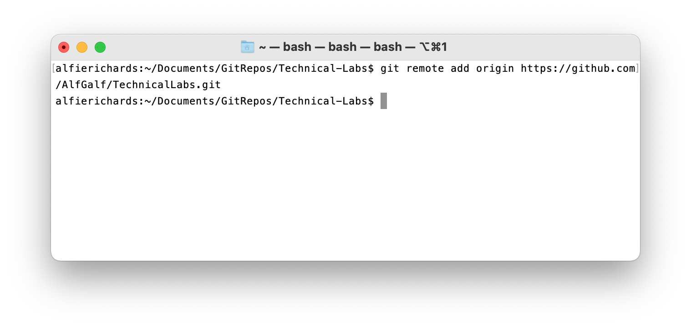

Now the Git remote is added. But the remote is empty so we need to push to the 
remote, which means sending all the commits in our history to the remote, which, 
thankfully, Git can do easily and efficiently.

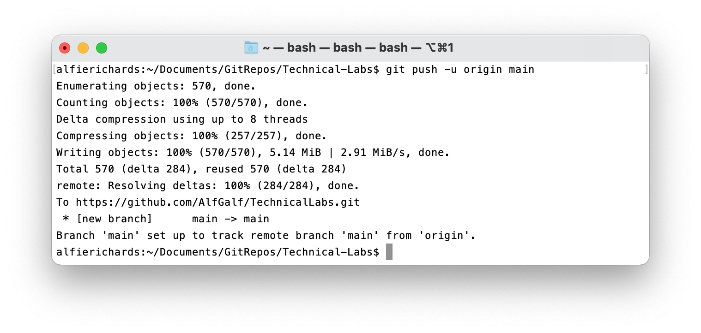

If we now look at the remote on GitHub we will now see the files of our most 
recent commit on the main branch, and we can go through and see all of the 
commits making up our history.

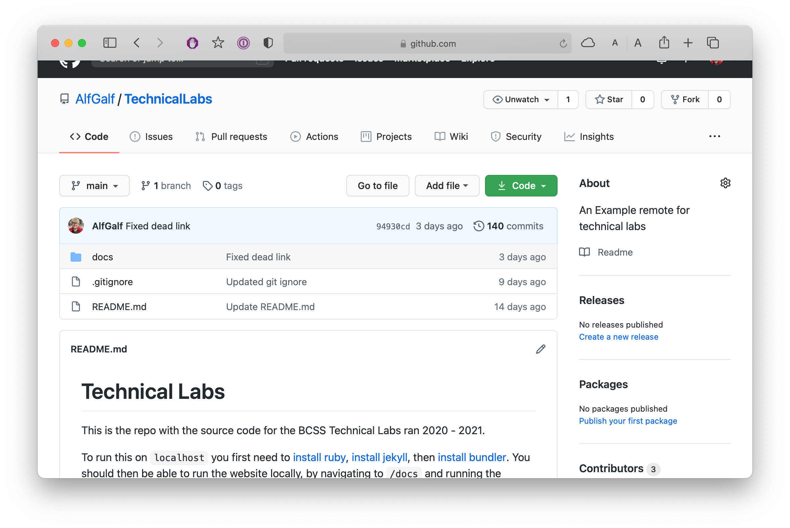

If we now add some new changes to our local repository we can push the new 
commit. 

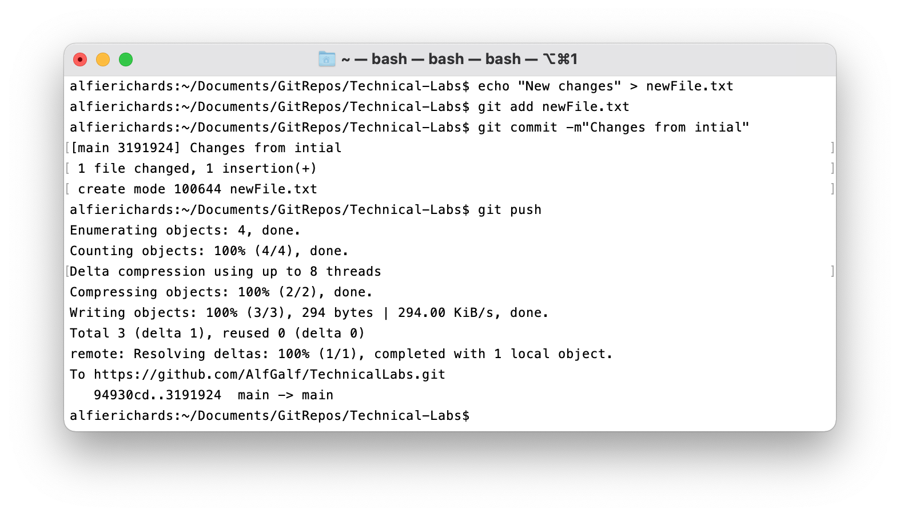

And if we look at GitHub you will see the new file.

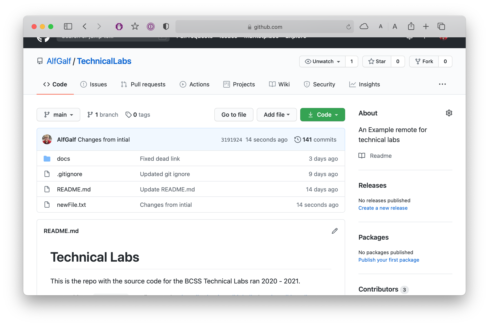

Now imagine we're working on this project with others. They may have have cloned 
the repository and submitted changes of their own. Alternatively you may 
have made changes from a different machine. Here, I have just added changes from 
another clone I made.

We can then use `git fetch` to pull the changes into the remote tracking 
branches on our local repo.

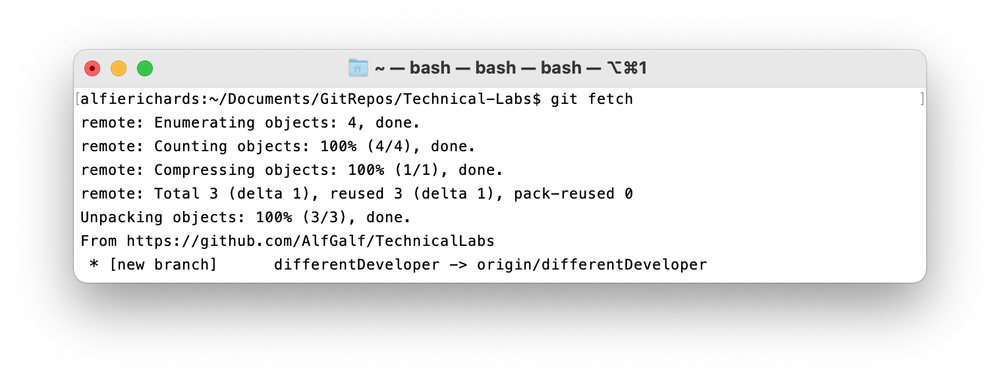

And then we can look at the remote tracking branches to see what branches there 
are.

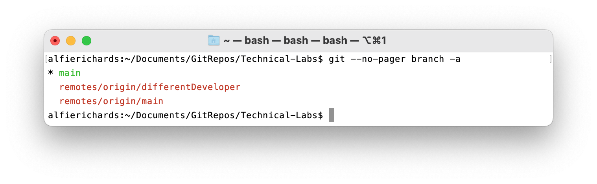

Here you can see another developer did work on the branch `differentDeveloper` 
and then pushed that branch to the remote. In this instance I want to merge the 
other developer's changes into my main branch, then push the merged branch with 
the changes to the remote.


### Cloning a repository

If a remote repository already exists you may want to clone that repository, to 
get a local copy of that repository.

To do this we will need to issue the command 
`git clone <git url> [directory name]`. Where the Git URL is the same as before, 
and the directory name is the name of the directory you want the repository to 
be put into.

Here we will clone the same remote into a new local repository.

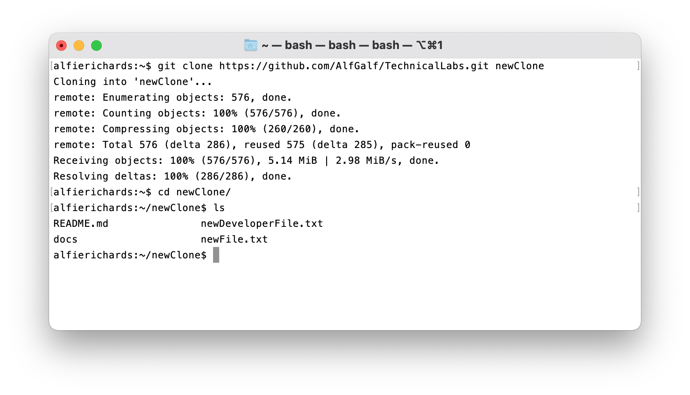

With the `git clone` command Git automatically adds the remote it was copied 
from as the `origin` remote.

## Collaboration best practices and techniques

Now you have seen how to make a repository, push your changes to it, and pull 
other people's changes into your repo.

It's important to run through the following in order to keep everything 
organised and save you headaches:

- Basic rules for using Git remotes
- Common techniques you can use in your repositories 

### Basic rules

1. Don't work on the same branch as other people. If you and a collaborator work 
   on the same remote branch you will quickly start having issues. This is 
   because one of you will push some commits, then another will try to push 
   commits, but they will get rejected because their commits were supposed to 
   attach to an earlier commit. Thus they must pull the changes before they can 
   commit. This leads to them having to do a merge almost every time they want 
   to push changes, which is tiresome.
2. Don't alter history already committed. It is possible to change commits in 
   your history. Some common ways are `git commit --amend` to add changes to 
   your last commit, or `git rebase`, which isn't covered in this series. 
   However, if you do this after having pushed those changes it is possible 
   another developer could have fetched your changes already. Then you are 
   changing the history they have already pulled, and when they next try to 
   push, all sorts of conflicts will happen and headaches will follow.
3. Don't commit directly to the main (or master) branch. The majority of repos 
   keep the main branch strictly for known working commits. This means you can 
   always find a working version of the project in the main branch. If someone 
   were to work on the main branch it is likely they would have a few commits 
   with bugs and unfinished code, which would mean other developers wouldn't 
   have any version they could use if they needed to deploy a working version or 
   check something.

### Basic techniques

There are some common techniques for managing your Git repositories and 
keeping them organised. Here we'll just run through a few - there are many more 
you'll find people arguing about online.

Firstly, each bug fix and feature should have its own branch, and the name of 
the branch should start with `feat/<feature_name>` and `bug/<bug_name>` 
respectively. This allows for much easier tracking of bugs and features, stops 
development happening on the same branch, and facilitates concurrent 
development.

Secondly, each commit is encouraged to represent an atomic change. You should 
try to avoid having multiple changes within one commit.

Thirdly, it is extremely helpful for anyone glancing at the commit graph for all commits to have messages that describe the changes made within then.

Lastly, in many repositories it is encouraged that before you push to the 
remote you make sure your version of the codebase is in a functional state. You might want to avoid pushing 
half finished work.

### GitFlow

Additionally there are git extensions that facilitate certain git management strategies. 
[GitFlow](https://github.com/nvie/gitflow) is a popular example.

## Resolving merges

You may have noticed we talked a lot about merges, and indeed in most Git 
workflows merges are common. So let's briefly cover how to do a merge and how to 
resolve them.

Ideally with merges the two sets of changes will be independent from each other 
(i.e. not changing the same lines), and Git will be able to automatically 
combine them. However, this is often not the case: if the two sets of changes 
have edited the same lines, this will result in "merge conflicts". 

Start a merge with the command `git merge <branch_name>`, and if it can be 
completed automatically, Git will give a success message and prompt you for a 
message for the new commit merging the two branches. However, instead it will 
often return a message stating the commit can't be completed. Git will have 
added "conflict markers" to the conflicting files. At this point you have two 
options: either you can use the command `git merge --abort` to abort the commit 
and return to your previous commit, or you can go into the conflicting files and 
resolve the conflicts.

Conflict markers will look something like this:

```
<<<<<<< HEAD
The lines from the branch currently checked out
=======
The lines from the branch being merged in
>>>>>>> branch_being_merged_in
```

Where the lines with the `>`, `=`, and `<` are the conflict markers. Git is 
asking you to manually merge the two sets of changes, because it couldn't figure 
out how to automatically. Whether that means just keeping one or the other of 
the two blocks that are separated by markers, or manually editing them to 
combine changes made in both, you should remove the markers themselves and 
ensure the file is in a working state.

After removing the conflict markers you can stage the file again with 
`git add <file>`. Once you have done this for all conflicting files just run 
`git commit`, at which point Git will prompt you for a commit message. The merge 
is now complete.

There is specialised software to make resolving git merge conflict easier. Ofter IDEs come with 
software preinstalled. For instance Visual Studio Code has a popular tool for resolving conflicts.

## Pull requests

With GitHub in particular there is a very popular system for managing 
collaboration: forks and pull requests. In this system there will be a remote 
repository on GitHub which someone maintains. 

If you wanted to make some changes to the repo, the repo owner could 
add you as a contributor. This allows you to submit changes directly to the 
repository, and isn't always recommended. Alternatively (and more often), you 
will "fork" the repository, which means GitHub will make an identical repository 
in your account. You can then make any changes in this repository. 

When you have finished your changes on your fork you can submit a "pull 
request", which is a request for the main repository to pull from your forked 
repository. If accepted, this will add all of your changes to the main 
repository. The maintainers of the main repository can then look through the 
changes, alter them if they need, and add them in as they desire. 

You can also submit a pull request to request a merge of one branch into another 
within the same repository.

The system of forks and pull requests is a very common workflow in Git and is 
how we handled getting collaborators to suggest changes to these notes.

## Exercises

1. Make a GitHub account.
2. Add some of your local repositories to your GitHub account.
3. Clone the repositories of some projects on GitHub, for instance [this 
   project](https://github.com/AlfGalf/TechnicalLabs) or 
   [Jekyll](https://github.com/jekyll/jekyll) - the tool used to build the website 
   for these notes.
4. Try collaborating using Git on your next group project! Try to use good 
   practices and encourage others to do the same.
5. Practice good Git practices while working in your private repositories. You'll thank yourself later!

## References and resources

These notes are the second of two sessions on Git. The first can be found 
[here](https://bath-bcss.github.io/Technical-Labs/git.html).

A lot of this information comes directly from [this O'Reilly 
book](https://learning.oreilly.com/library/view/version-control-with/9781449345037/) 
which is available as part of the O'Reilly subscription all students at the 
University of Bath have access to.

Additionally there are some great resources for finding out more:

- [This 
    article](https://docs.microsoft.com/en-us/azure/devops/learn/devops-at-microsoft/use-git-microsoft) 
    by Microsoft explains their Git workflow.
- [Another 
    article](https://docs.microsoft.com/en-us/azure/devops/repos/git/git-branching-guidance?view=azure-devops) 
    by Microsoft explains more about Git.
- [GitHub's best practices 
    article](https://resources.github.com/videos/github-best-practices/).
- [Oh Shit, git!?!](https://ohshitgit.com) is a great resource explaining many 
    common Git pitfalls and how to get out of them.
- [Pro Git](https://git-scm.com/book/en/v2) is a free book explaining a lot more 
    of Git in much more detail, including distributed Git and Github.

## Thanks

These notes were written by [Alfie Richards](https://www.alfierichards.com).

Edited by [Joe Cryer](mailto:jcryer1234@gmail.com)

With additional additions and corrections by:

- [Søren Mortensen](https://neros.dev)
- [Steven Borrie](https://backslash.build/)

