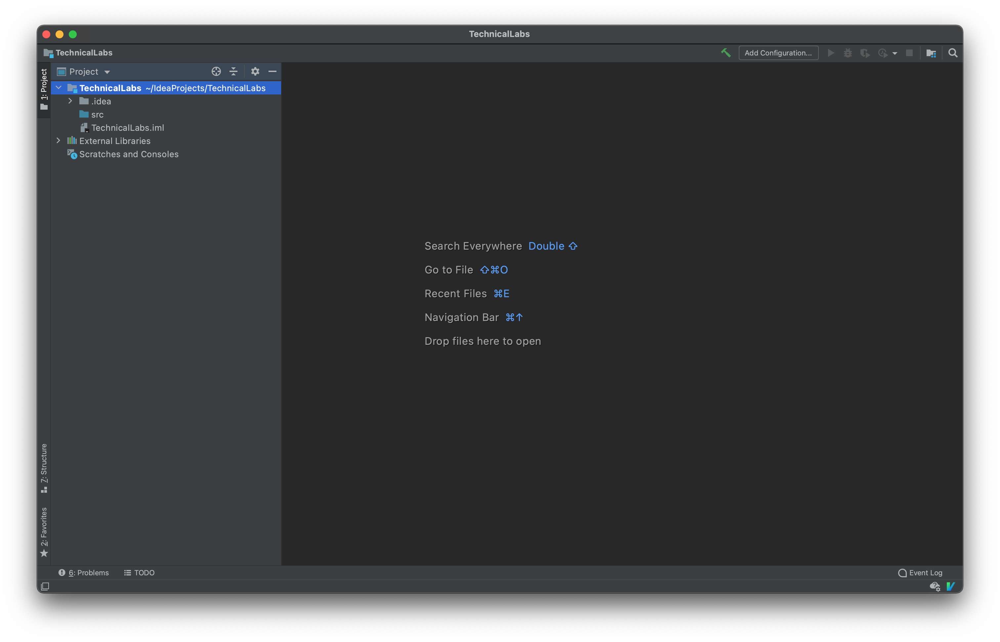
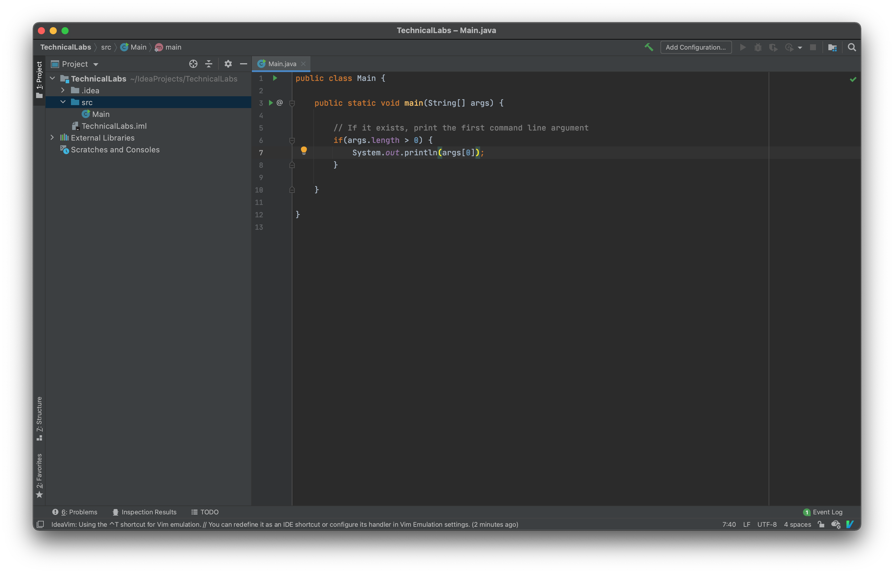
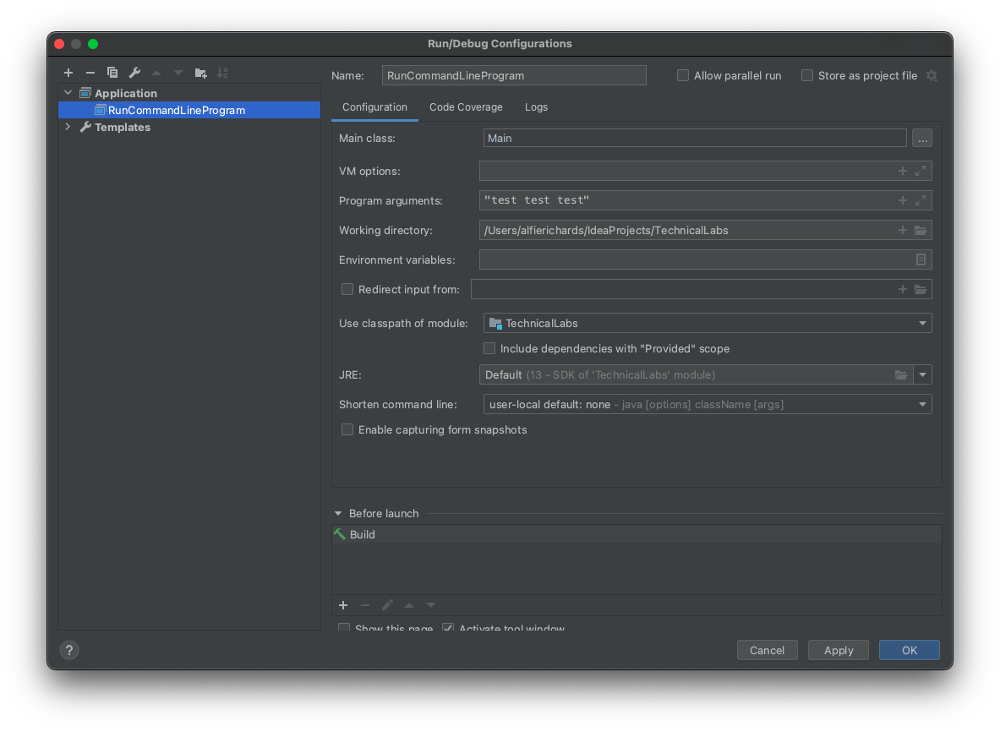

# IDEs and Jetbrains

## Table of Contents

## Introduction 

An IDE (or **I**ntegrated **D**evelopment **E**nvironment) is a GUI application 
that provides a comprehensive suite of tools for programmers. This is very different to the alternative, which is using separate programs for each task. IDEs have a gentler learning curve and wide spread usage than the alternative, making them a easier choice for 
less experienced programmers. In this lab we will aim to show the basics of the 
Jetbrains IntelliJ IDE, and we will introduce more general IDE concepts and context. Hopefully this can then be transferred to both other Jetbrains IDEs and other 
IDEs generally. Jetbrains has a large number of IDEs with support for the vast 
majority of popular languages.

IntelliJ is Jetbrains' first and largest IDE, and it is one of the most popular 
IDEs in the world. Initially it was only for Java development, but since then 
has added support for a [large number of 
languages](https://en.wikipedia.org/wiki/IntelliJ_IDEA#Supported_languages) and 
you can use modules to add support for even more. 

Additionally [Android Studio](https://developer.android.com/studio/) is built 
atop of IntelliJ. Most techniques learnt for IntelliJ can be used directly for 
Android Studio.

### Installing IntelliJ

You can download IntelliJ from the Jetbrains website 
[here](https://www.jetbrains.com/idea/), and as a student you can get the 
"Ultimate Edition" for free 
[here](https://www.jetbrains.com/community/education/#students).

Installation varies from platform to platform but is normally straightforward. 
Follow the instructions on IntelliJ's site.

When you first start IntelliJ you will be asked what theme you want to use and 
which plugins you want to install. I recommend you keep the number of plugins 
low, turning off some of the included ones. This reduces the number of features you're presented with when starting. Don't worry, you can add plugins back later.

## IntelliJ

IntelliJ is massively configurable. Nearly all behaviours and keyboard 
shortcuts can be configured. For this reason we're going to be looking at 
IntelliJ as it comes out the box, and we'll be giving the default keyboard 
shortcuts for Windows and macOS, but you can change these as you wish.

IntelliJ is incredibly feature rich, which can be intimidating. But if you get 
to know how to do the basics you can start using it and learn the rest of the 
features as you need them.

## IntelliJ Basics

Lets run through some of the basics of IntelliJ before we start looking at some 
more advanced features.

### Making a project and project templates

When you start up IntelliJ for the first time you will be presented with a 
screen to create a new project or import a project. If you have already used 
IntelliJ on some projects you will see a list of the projects IntelliJ knows 
about on the left.

In the **Create Project** screen you will be presented with the **Templates** 
IntelliJ has installed. Templates are merely an initial set of project 
configurations and files to get you started with specific platforms. But 
projects are not set in stone by their template - you can add all the features 
and platforms you like to your project by changing the settings and files. A lot 
of developers avoid templates entirely.

You then have to give the project a name and tell IntelliJ where to save the project. Then press **Create** and IntelliJ will make a project with the files 
and settings from the template chosen.

With only the plugins I need installed and with no template installed my 
IntelliJ looks like this.

If you have more plugins installed your IntelliJ may look significantly busier.

### IntelliJ Layout

IntelliJ's layout is made up of **Tool Windows** around a central editor. What 
those windows contain and where they are is very flexible. You can add, remove, minimize, and move panes as you desire. Plugins can also provide 
additional tool panes.

The standard is to have navigation on the left with a central editor 
and panes regarding running programs (such as logs and debugging) at the bottom. 
By default IntelliJ uses this layout.

### Navigation

There are many ways to get around in IntelliJ, but the most basic is the 
**Project** pane on the far left. There is a drop down at the top to select which 
view you want to use. 

- The **Project** view shows the structure of your program
    by each file's dependencies. However this won't reflect the actual file 
    structure of your project. 
- The **File Structure** view shows the actual file structure of your project.
- The **Problems** view shows the problems IntelliJ has found in your project. 
    For instance the errors and warnings generated when the project attempts to 
    compile.

Double clicking any item in the **Project Navigation** pane will open it in a tab in 
the editor window.

Another way to get around is search - to open the search press `Shift` twice, enter whatever file or item you're searching for in 
the search window and then press 
enter to open a tab at that item.

There are many other ways to get around in IntelliJ, but they're outside the 
scope of this lab.

### Editing

Editing text and code in IntelliJ can be much like any other text editor you've 
used. But IntelliJ has lots of smart ways to make writing code a little easier.

IntelliJ has syntax highlighting by default, which can make understanding code a 
lot easier.

Also, IntelliJ will constantly inspect your code while you write it and find 
where your code doesn't match the configured code style options or is unlikely 
to compile. It will annotate with warnings and errors to show this.

#### Some simple tricks

##### Live templates 

IntelliJ has a bunch of shortcuts to avoid writing lines that you have to type over 
and over again. These are called **Live Templates**. For example, when writing Java 
you can type `sout` to make a `System.out.println();` statement. Other snippets 
like this can be found and configured in `IntelliJ Preferences > Editor > Live 
Templates`

##### Code generation

Often when writing Java you will find yourself writing code blocks like access 
methods or interface implementations, which are fairly simple. IntelliJ can 
write some code for you! Press `Alt+Insert` on Windows or `⌘N` on macOS to enter 
the **Code Generation** window. Then you can select what code you want IntelliJ to 
generate.

##### Quick fixes 

A lot of code problems, like typos, access modifier mismatches or
missing imports can be fixed pretty easily. At any point when editing IntelliJ 
you can open the **Quick Fixes** panel to display the solutions IntelliJ 
thinks it can provide in the code where the cursor is. To open the panel use the 
shortcut `Alt+Enter` on Windows or `⌥⏎` on macOS. Preview any fix with 
`Ctrl+Shift+I` on Windows or `⌥Space` on macOS. Just press `Enter` to apply the 
change.

##### Code formatting

A lot of Computer Scientists have strong opinions over how code should look. 
IntelliJ can keep your code consistent to a set of rules. You can get IntelliJ 
to reformat your code with `Ctrl+Alt+L` on Windows or `⌥⌘L` on macOS.

You can set your code style preferences in the IntelliJ preferences menu.

##### Renaming and refactoring

One of the most tiresome and error prone things to do when programming is to 
rename something or (more generally) to refactor code. Fortunately,IntelliJ will 
help you out with its extensive reformatting tools. You can find these in the 
**Refactor** section in the menu bar.

##### Generating documentation

IntelliJ can do some of the grunt work in writing JavaDocs - simply type `/**` in 
front of a class or function and IntelliJ will add lines for all the public 
fields or parameters.

### File management

File management can be done in the Project pane. To move files simply drag and 
drop them into place! As the result of a move you may be prompted to refactor 
code. To make new files you can right click in the Project pane and select 
`new`. It will then let you choose from a variety of supported file types. 

### Building, Compiling and Running

IntelliJ has a very flexible system for configuring build systems. Build systems 
will be the topic of a future lab so we won't cover them in depth here, but the gist is they can be used to automate the tasks required to 
build and compile a project. This could include tasks like finding and compiling 
dependencies, running tests on the code, compiling the code and running the 
compiled output.

The IntelliJ build configurations cover a large range. You can use build systems 
like Maven or Ant, or simply compile and run your code. Either way, it all starts 
in the `Run/Debug Configuration` window you get to from the configuration 
button / drop down in the top right. From this screen you can add as many 
configurations as you like. 

Here we will set up a simple configuration to run this command line application.

We want to make a configuration to compile and run this code. To do this go to 
the configuration plane again, and click the **Add** button in the top left. Here we 
can choose what template we want the run configuration to use - in this case the 
"Application" template does everything we want. We give the config a name and we 
specify the class we want the program to start with. We can specify options for 
the Java Virtual Machine, specify parameters for our program, and even specify 
environment variables. For this program we just need to specify the Main class 
and add some program arguments.

You could also select "Allow parallel run" if we need to run the same program 
multiple times. For example, if you were testing multiple clients for a server.

Now we have a configuration we can select it in the Run Config dropdown in the 
top right, and the Run button will then appear. Upon pressing that button 
IntelliJ will compile and run the program. You can also use `Shift+F10` on 
Windows or `⌃R` on macOS. 

After pressing the Run button IntelliJ will open the Build and Run panes in the 
bottom window. The Build pane shows the output of the build config, and the Run 
pane shows the `stdout` of the program and allows input into `stdin`.

#### Compiler output

By default all your source code should go in a directory called `src` and 
IntelliJ will output the compiled code into a folder called `out`. This keeps 
your file structure clean of binaries. You shouldn't include the 
`out` directory in any Version Control.

### Java docs

IntelliJ comes with an easy way to generate JavaDocs, you can find the tool in 
the menu bar:

`Tools > Generate Java Doc`

## Plugins

IntelliJ and all Jetbrains IDEs have very flexible and powerful plugin systems. 
Plugins can add an incredible amount including support for other languages, 
different build tools, themes, version control, and even plugins to assist 
with the development of plugins.

### Adding and removing plugins

You can enable, disable and remove plugins through a page in the 
preferences window:

`IntelliJ preferences > Plugins > Installed` 

You can find new plugins and install them from the Marketplace tab.

Plugins often add extra pages to the preferences window to let you alter the behaviour of 
the plugin.

### Version Control

One of the most popular category of plugins on Jetbrains IDEs are Version 
Control plugins. Git was the subject of the 2nd and 3rd Technical Labs and so 
won't be covered here. However the Version Control plugin and the Git and GitHub 
plugins allow you to run many Git commands directly from IntelliJ and present 
information about your repository in a GUI.

However, you do not need to use the plugins - if you are more comfortable with 
using Git in the command line or with another Git interface you can.

### Deployment plugins

There are lots of plugins to facilitate deployment and continuous integration. 
Both of which will be the subjects of future labs.

### IDE Feature Trainer

IntelliJ has a plugin available called IDE Feature Trainer that will walk you 
through a lot of the features of IntelliJ.

## Debugging

IntelliJ supports a powerful debugging and profiling suite. However debugging 
will be the subject of a future Technical Labs so we will not cover it in this 
lab. 

## `.idea` folder

IntelliJ stores all of its settings and information about a project in the `.idea` 
folder within the project. For any project in which you are using Version 
Control you should make the decision whether or not you will include it in the 
repository.

## Summary

We've shown you how to get around in IntelliJ, and tried to break down 
some of the scarier things IntelliJ will do. But more importantly we want to 
communicate that IDEs are tools for you, and you are in control of them. You can 
customise it to your liking and change its behaviour to match your tastes and 
needs. You do not need to keep all the plugins you are not using if they just add bloat. 
Equally, you can add plugins and tools for whatever you want, to make the IDE better 
for you.

We focused on IntelliJ a lot here, but all other Jetbrains IDEs 
are built on the same platform, and cover a massive range of languages. For 
instance you can use Pycharm for Python and CLion for C, and have a consistent and similar
experience between all of them.

There are also lots of other great tools and IDEs out there. They all have 
differences but almost everything gone through here is applicable to the 
majority of IDEs, just with different shortcuts and layouts.

Also, all of these features can be found in separate tools - an IDE simply gathers all the tools together into one program. Use whatever you prefer and feel most comfortable with.

## Exercises

1. Get a Jetbrains student account and download the Ultimate Edition of 
   IntelliJ
2. Make an empty project in IntelliJ
3. Make a basic `main` function and configure IntelliJ to compile and run the 
   program
4. Find some plugins you like (try Rainbow brackets)
5. Look into the Version Control plugin for IntelliJ
6. Get a Jetbrains IDE for a different language you use
7. Change the appearance and behaviour of IntelliJ to your liking
8. Open other Java projects in IntelliJ and set them up to run properly
9. Install and use the IDE Feature Trainer plugin

## Thanks and credit

The vast majority of the information for these notes comes from the 
[Jetbrains help 
articles](https://www.jetbrains.com/help/idea/discover-intellij-idea.html#developer-tools).

Written by [Alfie Richards](https://www.alfierichards.com/).

Edited by [Joe Cryer](mailto:jcryer1234@gmail.com)

Additional thanks to:
- [Søren Mortensen](https://neros.dev)

