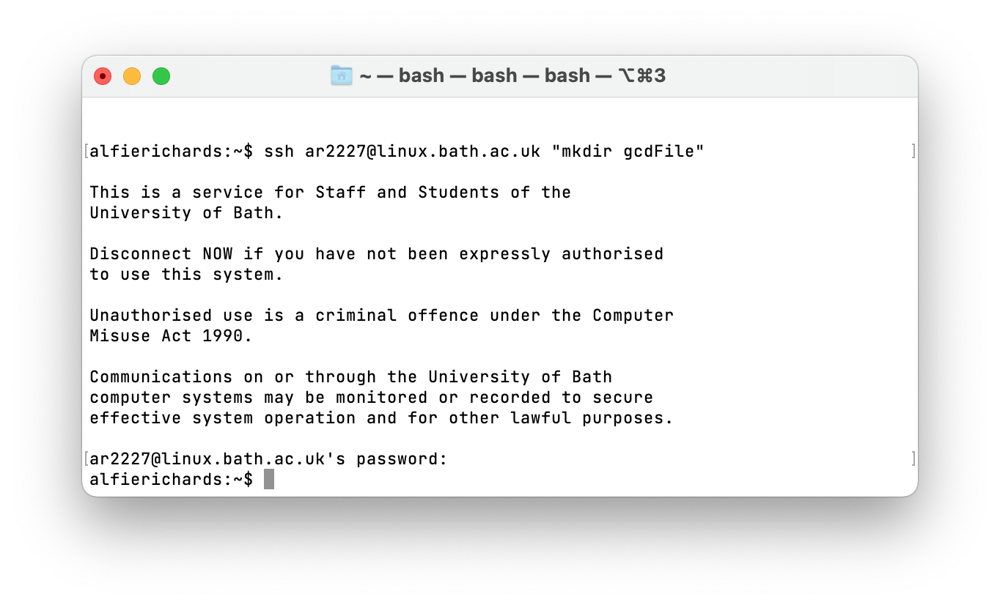
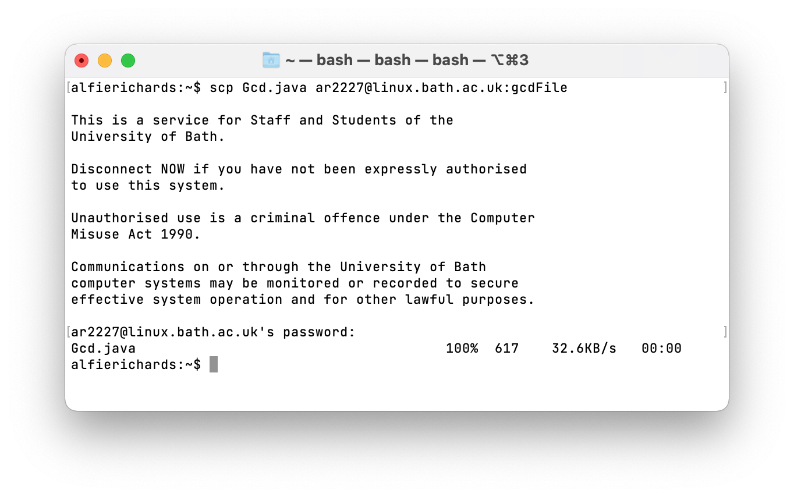
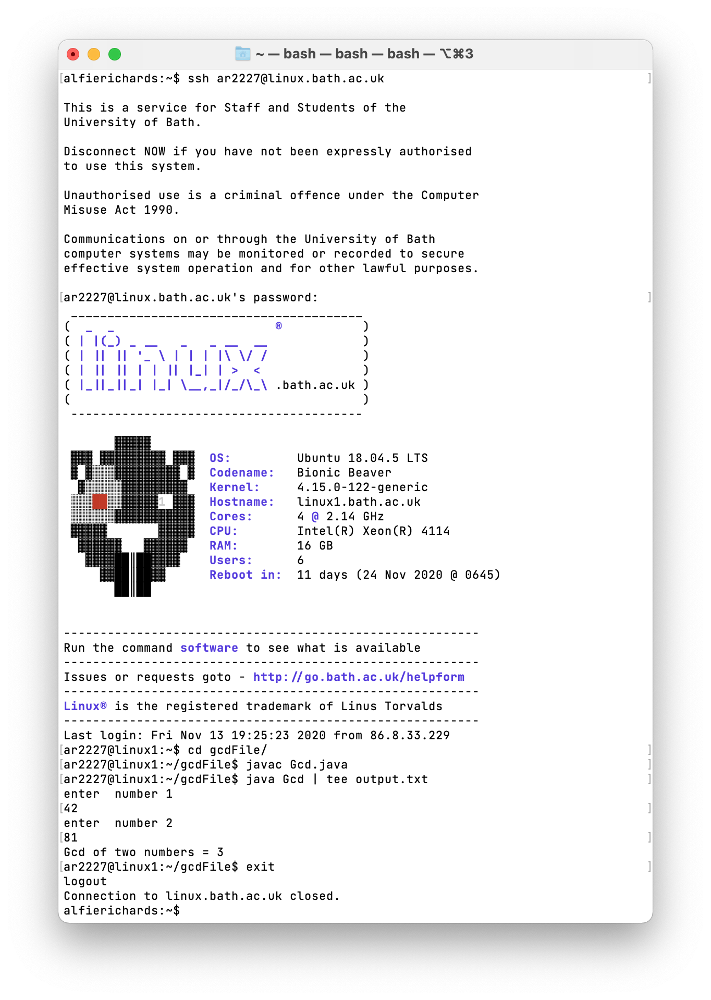
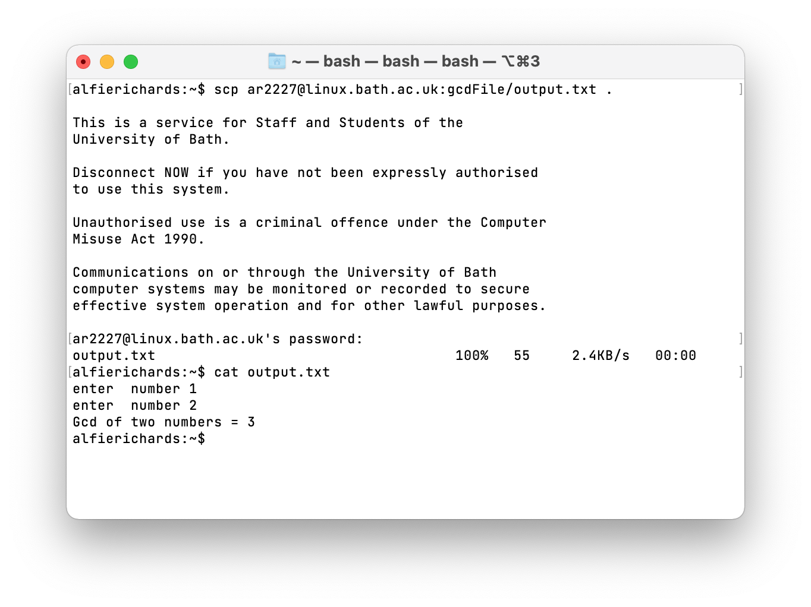

# SSH

## Table of Contents

## Introduction

SSH is an extremely widely used tool for connecting to remote computers. In this
lab we are going to give a basic introduction to what SSH is, how it works, how 
to use it, and then an example of how to setup SSH for `linux.bath`.

## What is SSH

SSH stands for **S**ecure **Sh**ell, and is a cryptographic network protocol for 
communicating securely over unsecured networks. SSH can be used to secure any 
network service but most commonly is used for remote command 
line access, login, remote command execution and file transfer. These are what 
we will focus on here.

Put more simply, SSH can do many things, but we're going to use it to open and 
access a commandline shell on a remote computer, usually a server. This will typically be a Unix-shell which was covered in a previous lab you can access 
[here](Unix_Shell.md).

SSH is now supported by all the major desktop operating systems (Windows 10, 
macOS, the majority of Linux distros) and the vast majority of networking 
equipment supports SSH for remote management. Indeed most servers are controlled
via SSH.

## How does SSH work

SSH is a protocol which many tools use. The protocol is structured into different layers, 
where each layer uses the previous layer to communicate.

The first layer is the **Transport Layer**. When you start an SSH connection this 
layer connects to the remote computer and sets up an encrypted secure 
connection between the two computers.

Next is the **User Authentication Layer**, which handles client authentication. This
can either be with a password or with cryptographic private and public keys.

The last layer is the **Connection Layer**. This layer carries the `channels` of 
information. You could have a shell channel, carrying input and output back and 
forth, or it could be a file transfer channel, or many other types.

SSH also defaults to connecting over port 22. This can be changed if 
needed.

## Using SSH

The most common SSH client is `OpenSSH`. It comes installed by default on 
Windows 10, macOS, and most Linux distros, so it is the tool we will be covering
here.

### Opening an SSH connection

To open a SSH remote commandline connection in OpenSSH we use the command `ssh [address]` where `address` is the address of the server you want to connect to.
Unless you have a configuration set for this address, OpenSSH will try to login with
your current username. If that's not the behaviour you want you can specify what username to use to login with by using 
the command `ssh [user]@[address]` where `user` is your username. When you connect you
may be prompted for a password.

Alternatively you can execute a single command on a remote computer with the 
command `ssh ([user]@)[server] [command]`. OpenSSH will show you the result of 
the command.

To transfer files with OpenSSH you need to use a different program - the SSH copy
program `scp`.

To send a file to a remote computer use the command 
`scp [file] ([user]@)[address]:[path]`, where `file` is the file you want to 
send, and `path` is the directory where you want to save it on the remote 
computer. This may look a bit confusing, but later we'll show an example.

To copy a file from the remote computer use the command 
`scp ([user]@)[address]:[file] [path]`, where `file` is the file you want to copy
from the remote computer and `path` is where you want to store it locally.

For both directions of `scp` you can add the `-r` command and specify a 
directory instead of a file - this will then recursively copy the directory and 
all its contents.

## Configuring SSH

SSH allows you to configure some of its default behaviours. On Unix-like machines the configuration files are stored in `~/.ssh/config`.

If you have servers you have to access often you can make custom configurations 
for them by adding a `Host [name]` block. You can then add sections specifying the
username you want to use, and the hostname. Here you can also specify the 
cryptographic key if you're using it for authentication. The block for a server 
will probably look something like this:

```
Host MyServer
    Hostname 139.161.208.134
    User myUser
```

You can also specify many more options that can be found in the ssh `man` page.

## Connecting to `linux.bath` with SSH

`linux.bath.ac.uk` is an Ubuntu server setup for Bath students and staff. You 
can login with your university username and password. In this example I'm going 
to upload a Java file to `linux.bath`. I'll then login to `linux.bath`, compile 
the code and run it. I'll save the output of the program and then copy it back 
to my computer.

For this I will also assume a little bit of knowledge about some file management
commands in Unix. To learn more about that look at our first lab.

The program is available 
[here](https://javatutoring.com/gcd-of-two-numbers-java-program/). It calculates
the greatest common divisor of two numbers.

Firstly, I want to create a directory on the server. To do this I can do the remote 
execution of a command - 
`ssh ar2227@linux.bath.ac.uk "mkdir gcdFile"`



Note it's now prompting me for my password.

Next, I'm going to use `scp` to copy my code to the server. To do this I use the
command `scp Gcd.java ar2227@linux.bath.ac.uk:gcdFile`.



Then I need to open a remote shell on the server, compile my code, run it, 
and save the output. To open the shell I'm going to run 
`ssh ar2227@linux.bath.ac.uk`.



Then I'm going to copy the output file to my local computer with 
`scp ar2227@linux.bath.ac.uk:gcdFile/output.txt .`.



And we're done! We successfully used the remote server to compile and run our code.

## Exercises

1. Connect to `linux.bath` and have a look around, there will already be some 
   files in there that come by default. 
2. Copy some files to and from `linux.bath`. You will be able to see them on the
   [Bath files explorer website](files.bath.ac.uk).
3. Look into using cryptographic keys for authentication. See if you can set one
   up for GitHub or some other server. (`linux.bath` does not support it).
4. Connect to `linux.bath` and run `mkhome` to setup your [Bath people 
   page](people.bath.ac.uk). You can get to your page at 
   `people.bath.ac.uk/[username]/`

## Credit

SSH research came from [SSH.com](https://www.ssh.com) which is a great website 
setup by the creator of SSH and from 
[Wikipedia](https://en.wikipedia.org/wiki/SSH_(Secure_Shell)).

Written by [Alfie Richards](www.alfierichards.com).

Edited by [Joe Cryer](mailto:jcryer1234@gmail.com)

Additional help from:


