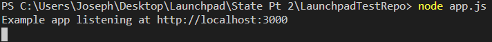
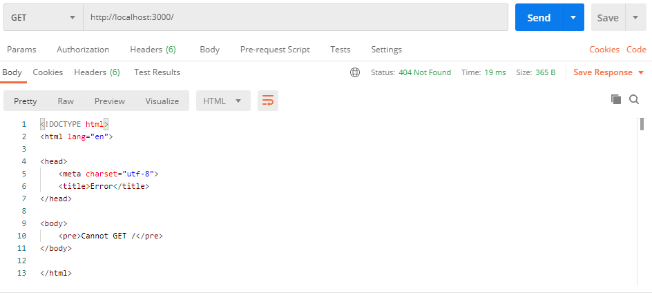
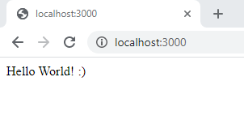
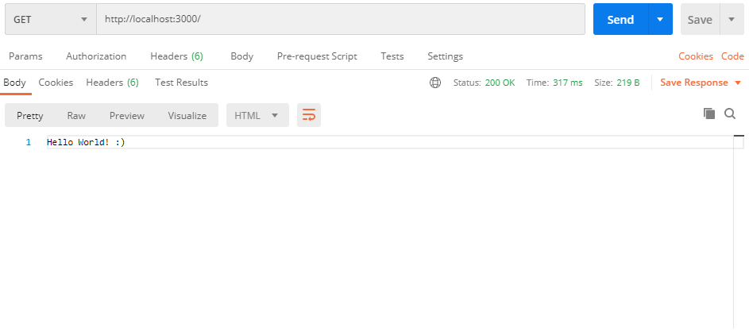
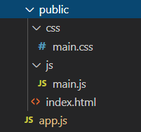
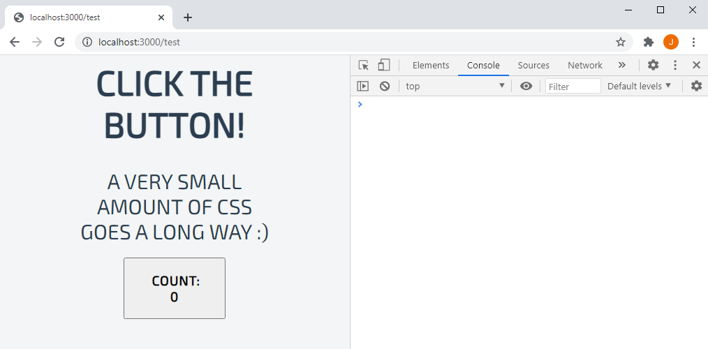
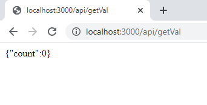
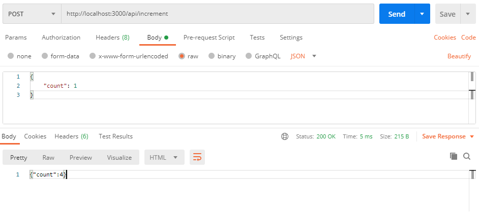

# Getting Started

## Dependencies

### **Node.js**
**Node.js** is a JavaScript runtime environment. We'll be using it as the 'server' for our web app. Head [here](https://nodejs.org/en/download) to download the installer (unless on Linux, then you're on your own). Follow the installer instructions and you should be good!

To check that it is installed, run this command in your terminal:
```
node -v
```

### **npm**
**npm** (or '**N**ode **P**ackage **M**anager') is the package manager for JavaScript. It is distributed with **Node.js**, meaning that when you download **Node.js**, **npm** is automatically installed. 

To check that it is installed, run this command in your terminal:
```
npm -v
```

### Code Editor
A good code editor is incredibly important, and helps you massively in the long run.
Having said that, we don't have time to cover this. [Visual Studio Code](https://code.visualstudio.com/download), [Jetbrains WebStorm](https://www.jetbrains.com/webstorm/download/#section=windows) (you get this for free with a student license) or [Atom](https://atom.io/) are all good choices for web development. We will be using VS Code. 

## Initial Node.js Project

In this project, Node.js will run on a 'server' computer and will host a webserver. Anybody that goes to the correct web address will be accessing the webserver and interacting with whatever we write. 

Let's start by making an **app.js** file. 

```js
const express = require('express');
const app = express();

const port = 3000;

app.listen(port, () => {
  console.log(`Example app listening at http://localhost:${port}`)
});
```

This is a bare-bones initial Node.js server. However, if we try to run this with the command `node app.js`, it will immediately fail, as we are using the **express** library. To install this, run the command `npm install express` in the folder. Once this has installed, we should be able to run the server with `node app.js`! 



If we go to the web address [localhost:3000](localhost:3000), we see an error message: **Cannot GET /**. This is fine, as we aren't yet providing any content, but still shows that the server is functioning.


**Postman** is an application that allows you to inspect HTTP web requests in detail. Let's see what the Node server is sending to the client when we go to [localhost:3000](localhost:3000).

 

The top section defines the request being made, while the bottom section shows the data that has been returned from the server.

This is a default HTML page being created by Node for endpoints that haven't been specified. This is the same as the content being displayed in the browser.

Now, let's provide some content to display! We're going to add a **GET** endpoint for **/**, which is the 'root' page - [localhost:3000](localhost:3000). To do this, we want to add a new code block in **app.js**: 

```js
app.get('/', (req, res) => {
    res.send("Hello World! :)");
});
```

Now, whenever we navigate to [localhost:3000](localhost:3000), we should be served the content "Hello World! :)". 

 

All that is being sent by the server is the plain text. We can see this when checking the endpoint in Postman:

 

Now, let's start serving a HTML page. Below is a simple HTML example - the one that we went through earlier. I'm going to create a folder called **public** and save this inside as **test.html**. 

```html
<!DOCTYPE html>
<html>
    <head>
        <script src="https://ajax.googleapis.com/ajax/libs/jquery/3.5.1/jquery.min.js"></script>
        <link href='https://fonts.googleapis.com/css?family=Exo 2' rel='stylesheet'>

        <script src="js/main.js"></script>
        <link rel="stylesheet" href="css/main.css">
    </head>
    <body>
        <div id="mainBlock">
            <h1 class="title">Click the button!</h1>
            <p class="subtitle">A very small amount of CSS goes a long way :)</p>
            <button class="btn draw-border" id="button1">Count: 0</button>
        </div>
    </body>
</html>
```

I've also defined **main.js** and **main.css** files within this file. Let's create those too, inside subfolders **js** and **css** respectively.

**main.js:**

```js
$(document).ready(function(){
    var count = 0;

    $('#button1').click(function() {
        count++;
        $('#button1').html("Count: " + count);
    });
});
```

**main.css:**

```css
body {
    font-family: 'Exo 2';
    background-color: #F3F5F6;
}
  
.title {
    font-weight: bold;
    font-size: 50px;
    color: #2C3E50;
    text-transform: uppercase;
    text-align: center;
    margin-top: 1%;
}
  
.subtitle {
    font-weight: 400;
    font-size: 30px;
    color: #2C3E50;
    text-transform: uppercase;
    text-align: center;
    margin: 10px;
}

#mainBlock {
    text-align: center;
    width: 60%;
    border: black 1px;
    margin: auto;
}
  .btn {
    cursor: pointer;
    line-height: 1.5;
    font: 700 1.2rem "Exo 2";
    text-transform: uppercase;
    padding: 1em 2em;
    letter-spacing: 0.05rem;
    width: 50%;
    margin: 10px;
  }
  .btn:focus {
    outline: none;
  }
```

Our file structure should now look something like this:

 

Now that we've created some content to serve, let's serve it! We need to use the built-in **Path** library, so we need to import it at the top of **app.js**.

```js
const path = require('path');
```

When someone goes to the **/test** endpoint, we want to show them **test.html**. To do this, we need to create a new endpoint, like we did before, but instead of serving plain text we need to serve the file itself.

```js
app.get('/test', (req, res) => {
  res.sendFile(path.join(__dirname + '/public/test.html'));
});
```

If we go to the [http://localhost:3000/test](http://localhost:3000/test) endpoint, we can see the page we created! However, upon a closer inspection, there is no CSS styling and the JavaScript isn't functioning properly. Here, I opened up the Chrome Developer Tools (by clicking F12) and went to the Console tab, to see the errors in the page. 

 

We can see that **main.js** and **main.css** aren't accessible by the page. That is because the **public** folder isn't actually public yet - Node is protecting it! Let's change that. Add this line to **app.js**:

```js
app.use(express.static('public'));
```

This line tells Node to allow direct access to any files within the **public** directory. 

Now that we've done that, we can see that the page has no more errors, and is correctly styled!



Now that the **public** directory is directly available, we can access any of the files within it through the web browser, using relative URLs. For example, we can look at **main.css** with the URL [http://localhost:3000/css/main.css](http://localhost:3000/css/main.css) and **main.js** with the URL [http://localhost:3000/js/main.js](http://localhost:3000/js/main.js).


### State
The system we've created so far is a counter. Whenever we click on the button on the webpage, the number increases by 1. However, this is entirely implemented within the clientside JavaScript. Within the browser, it is difficult to retain **state**. By this, I mean that if we were to refresh the page, the current count value would be reset to 0, as the count value is lost and recreated on reload of the page. 

There are ways to retain state entirely within a browser (see [cookies](https://www.w3schools.com/js/js_cookies.asp)), however we will not cover this. Instead, we will show you how to communicate between the client and the server to store and load data. 

Let's first create a few new API endpoints on the server. 

In **app.js**, add the following code towards the top of the file (after `const app = express();`):

```js
app.use(express.json());

var counter = 0;
```

This code defines a new variable called **counter**, which is an int set to 0. It also pulls in the **Express JSON** functions, allowing us to parse and understand the JSON objects being sent back and forth between the client and server as messages. 

Next, we will create a new GET endpoint: **/api/getVal**

```js
app.get('/api/getVal', (req, res) => {
    let retVal = {count: counter};
    res.send(JSON.stringify(retVal));
});
```

Whenever we visit [http://localhost:3000/api/getVal](http://localhost:3000/api/getVal), this code will create a JSON object containing the current value of the **counter** variable we just defined.

 

Next, let's create a simple POST endpoint: **/api/increment**

```js
app.post('/api/increment', (req, res) => {
    counter += parseInt(req.body.count);
    res.send(JSON.stringify({count: counter}));
});
```

As this endpoint is a POST and not a GET, it requires that we send it data of some sort. Whenever a POST request is sent to it with a **count** value in its body, the **counter** value on the server is increased by that **count** amount and the server replies with the new value of **counter**. 

Here, I will simulate a POST request to the endpoint using Postman:

 

Here, I run the POST request and the **count** value is incremented from 3 to 4. If I run the call again, it will be incremented to 5: 

 

With these two calls, we can now implement some sort of state for this variable that survives the refreshing of a web page. Let's modify our JavaScript code in **main.js** to use these API calls.

```js
$(document).ready(function(){
    $.get('api/countVal', function(data) {
        let count = JSON.parse(data).count;

        $('#button1').html("Count: " + count);
    });

    $('#button1').click(function() {
        $.post('api/increment', {'count': 1}, function(data) {
            let count = JSON.parse(data).count;
            $('#button1').html("Count: " + count);
        });
    });
});
```

When the page loads, the code now makes a GET request to the API to get the **count** value from the server. When it gets this, it updates the HTML to display this value. 

Whenever the button is clicked, a POST request is made to the API, passing in a **count** value of 1 - the value on the server will be incremented by 1, the server will return the new value, and the client will update the HTML to display this value. 

